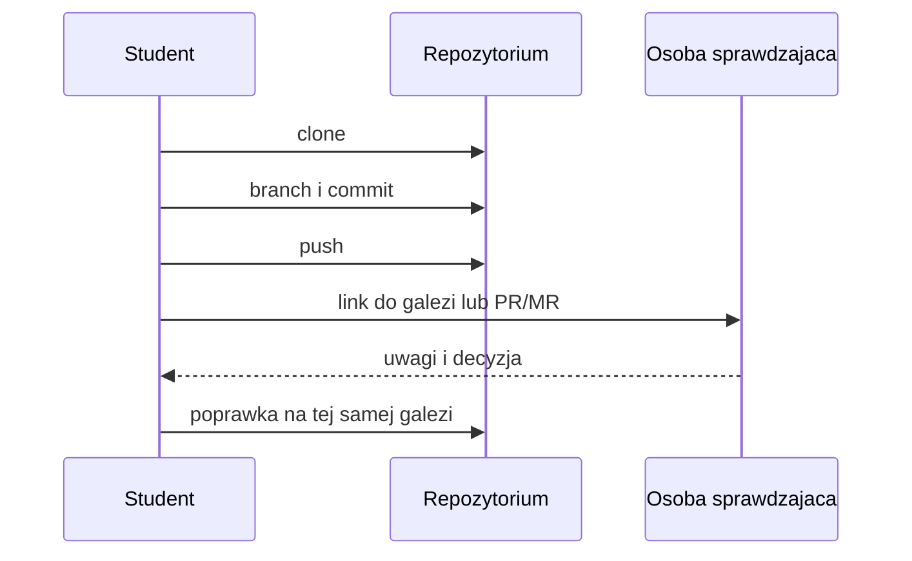

# 01. Repozytorium kursowe i wymagane konta

## Cel

Po wykonaniu tematu student potrafi wyjasnic, gdzie przechowywany jest kod, jak nadac sobie
dostep do pracy i jak przekazac zmiane innym osobom bez wysylania plikow jako zalacznikow.

## Pojecia potrzebne na starcie

- **Repozytorium** - katalog z plikami projektu oraz historia zmian.
- **Remote** - adres zdalnego repozytorium, np. na GitHubie albo GitLabie.
- **Branch (galaz)** - osobny strumien zmian, na ktorym mozna pracowac bez niszczenia wersji glownej.
- **Commit** - opisany punkt w historii zmian.
- **Pull request / merge request** - prosba o przejrzenie i wlaczenie zmian.

Nie trzeba zapamietywac wszystkich komend. Trzeba rozumiec, jaki rezultat ma miec kazdy krok.

## Wymagane konta

1. **GitHub** - konto do pracy z repozytorium kursowym, jesli grupa korzysta z GitHuba.
2. **GitLab** - konto do pracy z repozytorium kursowym, jesli grupa korzysta z GitLaba.
3. **Konto uczelniane** - konto, ktore moze byc potrzebne do zaproszenia do prywatnej grupy lub projektu.

Prowadzacy powinien przed zajeciami podac, czy grupa pracuje na jednej platformie, czy na obu.
Student nie powinien zakladac drugiego konta tylko po to, aby ominac problem z dostepem.
Najpierw nalezy sprawdzic zaproszenia, adres e-mail i ustawienia prywatnosci.

Oficjalne instrukcje:

- [GitHub: tworzenie repozytorium](https://docs.github.com/en/repositories/creating-and-managing-repositories/creating-a-new-repository)
- [GitHub: klonowanie repozytorium](https://docs.github.com/en/repositories/creating-and-managing-repositories/cloning-a-repository)
- [GitLab: tworzenie projektu](https://docs.gitlab.com/ee/user/project/working_with_projects.html)
- [GitLab: klonowanie repozytorium](https://docs.gitlab.com/ee/gitlab-basics/start-using-git.html)

## Pierwszy przeplyw pracy

Przykladowe polecenia nalezy wykonywac w terminalu otwartym w katalogu, w ktorym ma powstac
kopia repozytorium. Nazwa galezi powinna opisywac zadanie, a nie osobe.

```text
git clone ADRES_REPOZYTORIUM
cd NAZWA_REPOZYTORIUM
git switch -c zadanie/01-pierwszy-commit
# utworz lub zmien plik
 git status
git add README.md
git commit -m "Dodaj opis pierwszego zadania"
git push -u origin zadanie/01-pierwszy-commit
```

Spacja przed `git status` w powyzszym bloku jest celowo pokazana jako blad do znalezienia.
Poprawna wersja to `git status` bez dodatkowej spacji na poczatku wiersza.

### Co sprawdzic po kazdym kroku

| Krok | Pytanie kontrolne |
| --- | --- |
| clone | Czy katalog projektu pojawil sie lokalnie? |
| branch | Czy nazwa galezi opisuje konkretne zadanie? |
| status | Czy wiem, ktore pliki sa zmienione? |
| commit | Czy komunikat mowi, co sie zmienilo? |
| push | Czy zmiana jest widoczna na platformie? |

## Zasady bezpieczenstwa

- Nie umieszczaj w repozytorium hasel, kluczy API, tokenow, plikow `.env` ani danych osobowych.
- Nie uzywaj cudzego konta ani nie udostepniaj swojego hasla.
- Sprawdz adres remote przed wyslaniem zmian.
- Jesli repozytorium jest prywatne, nie zmieniaj jego widocznosci bez uzgodnienia z prowadzacym.

## Zadanie dla studenta

1. Przyjmij zaproszenie do repozytorium kursowego.
2. Sklonuj repozytorium do katalogu na komputerze.
3. Utworz galaz `zadanie/01-profil`.
4. Dodaj plik `profil.md` z imieniem lub pseudonimem, zainteresowaniem technicznym i jednym celem na kurs.
5. Wykonaj `git status`, zapisz wynik w notatkach, a potem utworz commit i wypchnij galaz.
6. W opisie oddania podaj: nazwe galezi, skrot commitu i informacje, jak usunales dane wrazliwe.

### Rozwiazanie i wyjasnienie

Przykladowy rezultat powinien wygladac tak:

```text
warsztat-programisty/
|-- README.md
|-- profil.md
`-- ...

galaz: zadanie/01-profil
commit: Dodaj profil studenta
status po commicie: czysty
```

Nie oceniamy tresci zainteresowania. Oceniamy, czy student potrafi przejsc caly przeplyw:
dostep -> kopia lokalna -> galaz -> zmiana -> kontrola -> commit -> push. Polecenie `git status`
przed commitem ma pokazac nowy plik; po poprawnym commicie nie powinno pozostac nic niezatwierdzone.

## Checklista oddania

- [ ] Repozytorium otwiera sie z wlasnego konta.
- [ ] Galaz nie jest `main` lub `master`.
- [ ] Commit ma opis zgodny z wykonana zmiana.
- [ ] Na zdalnej platformie widac galaz i plik.
- [ ] W repozytorium nie ma sekretow ani plikow prywatnych.

## Diagram



Zrodlo diagramu: [przeplyw repozytorium](diagramy/przeplyw-repozytorium.mmd).
