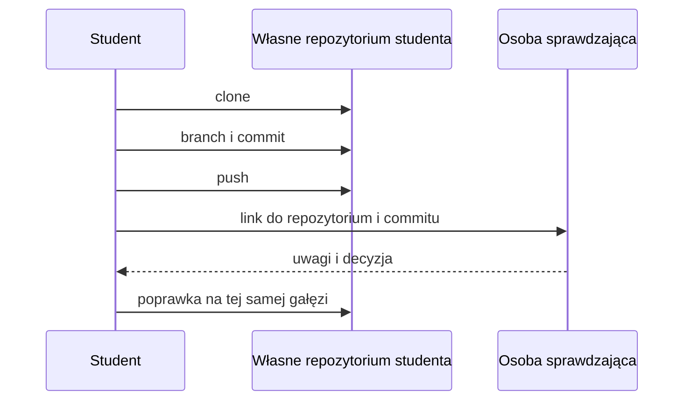

# 01. Repozytorium kursowe, własne repozytorium i wymagane konta

## Cel

Po wykonaniu tematu student potrafi wyjaśnić, czym różni się repozytorium kursowe od własnego
repozytorium, jak utworzyć miejsce na swoje rozwiązania i jak udostępnić je bez wysyłania
plików jako załączników.

## Pojęcia potrzebne na starcie

- **Repozytorium** - katalog z plikami projektu oraz historia zmian.
- **Repozytorium kursowe** - miejsce, w którym prowadzący publikuje materiały i instrukcje.
- **Własne repozytorium** - projekt studenta na GitHubie lub GitLabie, do którego student
    dodaje rozwiązania i link do oddania.
- **Remote** - adres zdalnego repozytorium, np. na GitHubie albo GitLabie.
- **Branch (gałąź)** - osobny strumień zmian, na którym można pracować bez niszczenia wersji głównej.
- **Commit** - opisany punkt w historii zmian.
- **Pull request / merge request** - prośba o przejrzenie i włączenie zmian.

Nie trzeba zapamiętywać wszystkich komend. Trzeba rozumieć, jaki rezultat ma mieć każdy krok.

## Wymagane konta

1. **GitHub** - konto, na którym student może utworzyć własne repozytorium.
2. **GitLab** - konto, na którym student może utworzyć własne repozytorium.
3. **Konto uczelniane** - konto, które może być potrzebne do dostępu do materiałów lub usług uczelni.

Prowadzący powinien przed zajęciami podać, czy grupa korzysta z GitHuba, GitLaba, czy obu
platform. Student nie powinien zakładać drugiego konta tylko po to, aby ominąć problem z
dostępem. Najpierw należy sprawdzić adres e-mail i ustawienia prywatności.

Oficjalne instrukcje:

- [GitHub: tworzenie repozytorium](https://docs.github.com/en/repositories/creating-and-managing-repositories/creating-a-new-repository)
- [GitHub: klonowanie repozytorium](https://docs.github.com/en/repositories/creating-and-managing-repositories/cloning-a-repository)
- [GitLab: tworzenie projektu](https://docs.gitlab.com/ee/user/project/working_with_projects.html)
- [GitLab: klonowanie repozytorium](https://docs.gitlab.com/ee/gitlab-basics/start-using-git.html)

## Pierwszy przepływ pracy

Przykładowe polecenia dotyczą własnego repozytorium studenta. Najpierw utwórz puste
repozytorium na GitHubie lub GitLabie, a następnie sklonuj je do lokalnego katalogu.
Nazwa gałęzi powinna opisywać zadanie, a nie osobę.

```text
git clone ADRES_WLASNEGO_REPOZYTORIUM
cd NAZWA_WLASNEGO_REPOZYTORIUM
git switch -c zadanie/01-pierwszy-commit
# utwórz lub zmień plik
 git status
git add README.md
git commit -m "Dodaj opis pierwszego zadania"
git push -u origin zadanie/01-pierwszy-commit
```

Spacja przed `git status` w powyższym bloku jest celowo pokazana jako błąd do znalezienia.
Poprawna wersja to `git status` bez dodatkowej spacji na początku wiersza.

### Co sprawdzić po każdym kroku

| Krok | Pytanie kontrolne |
| --- | --- |
| clone | Czy katalog projektu pojawił się lokalnie? |
| branch | Czy nazwa gałęzi opisuje konkretne zadanie? |
| status | Czy wiem, które pliki są zmienione? |
| commit | Czy komunikat mówi, co się zmieniło? |
| push | Czy zmiana jest widoczna na platformie? |

## Zasady bezpieczeństwa

- Nie umieszczaj w repozytorium haseł, kluczy API, tokenów, plików `.env` ani danych osobowych.
- Nie używaj cudzego konta ani nie udostępniaj swojego hasła.
- Sprawdź adres remote przed wysłaniem zmian.
- Jeśli repozytorium jest prywatne, nie zmieniaj jego widoczności bez uzgodnienia z prowadzącym.

## Zadanie dla studenta

1. Utwórz własne repozytorium na GitHubie lub GitLabie.
2. Sklonuj własne repozytorium do katalogu na komputerze.
3. Utwórz gałąź `zadanie/01-profil`.
4. Dodaj plik `profil.md` z imieniem lub pseudonimem, zainteresowaniem technicznym i jednym celem na kurs.
5. Wykonaj `git status`, zapisz wynik w notatkach, a potem utwórz commit i wypchnij gałąź.
6. W opisie oddania podaj: nazwę gałęzi, skrót commitu i informację, jak usunąłeś dane wrażliwe.

### Rozwiązanie i wyjaśnienie

Przykładowy rezultat powinien wyglądać tak:

```text
warsztat-programisty/
|-- README.md
|-- profil.md
`-- ...

gałąź: zadanie/01-profil
commit: Dodaj profil studenta
status po commicie: czysty
```

Nie oceniamy treści zainteresowania. Oceniamy, czy student potrafi przejść cały przepływ:
dostęp -> kopia lokalna -> gałąź -> zmiana -> kontrola -> commit -> push. Polecenie `git status`
przed commitem ma pokazać nowy plik; po poprawnym commicie nie powinno pozostać nic niezatwierdzone.

## Checklista oddania z własnego repozytorium

- [ ] Repozytorium znajduje się na moim koncie GitHub lub GitLab.
- [ ] Gałąź nie jest `main` lub `master`.
- [ ] Commit ma opis zgodny z wykonaną zmianą.
- [ ] Na zdalnej platformie widać gałąź i plik.
- [ ] W repozytorium nie ma sekretów ani plików prywatnych.

## Diagram



Źródło diagramu: [przepływ repozytorium](diagramy/przeplyw-repozytorium.mmd).
