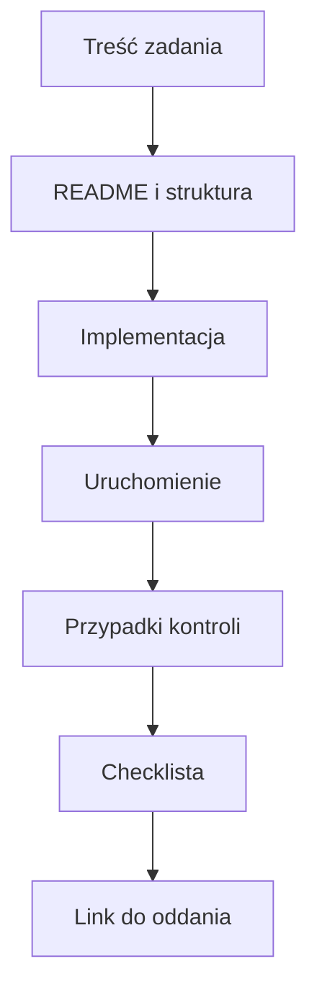

# 02. Struktura materiałów i zasady oddawania

## Cel

Student potrafi ułożyć małą pracę tak, aby inna osoba mogła ją znaleźć, uruchomić i ocenić
bez rozmowy na żywo. Struktura katalogów jest częścią jakości, a nie dekoracją.

## Proponowana struktura repozytorium kursowego

```text
repozytorium-kursowe/
|-- README.md
|-- src/
|   |-- 01-organizacja/
|   |-- 02-debugowanie/
|   `-- ...
|-- zadania/
|   |-- 01-nazwa-zadania/
|   |   |-- README.md
|   |   |-- src/
|   |   `-- tests/
|   `-- ...
|-- docs/
|   `-- notatki.md
`-- .gitignore
```

W tym repozytorium materiały z pierwszych zajęć są w [katalogu `src/01-organizacja`](../README.md).
Nazwy powinny być krótkie, numerowane i zrozumiałe bez otwierania pliku.

## Co powinien zawierać katalog zadania

| Element | Odpowiada na pytanie |
| --- | --- |
| `README.md` | Co było celem i jak uruchomić rezultat? |
| `src/` lub pliki z kodem | Gdzie jest implementacja? |
| `tests/` | Jak sprawdzono działanie? |
| `diagramy/` | Jaki przepływ lub model warto zobaczyć? |
| `.gitignore` | Czego nie dodajemy do historii? |

Nie każde zadanie musi mieć wszystkie katalogi. Nie tworzymy pustych folderów tylko dlatego,
że widzieliśmy je w szablonie. Struktura ma pomagać w nawigacji.

## Minimalny README pracy

```markdown
# Nazwa zadania

## Cel
Jedno zdanie opisujące rezultat.

## Uruchomienie
1. Zainstaluj wymagane narzędzie.
2. Uruchom polecenie ...

## Sprawdzenie
- przypadek zwykły: ...
- przypadek brzegowy: ...
- oczekiwany rezultat: ...

## Zakres oddania
- [x] kod
- [x] instrukcja
- [x] testy lub opis kontroli
```

Instrukcja powinna zawierać konkretne polecenia, ale nie powinna zakładać, że odbiorca zna
lokalną konfigurację autora. Jeśli wymagane jest ustawienie zmiennej środowiskowej, trzeba
podać jej nazwę i opisać, skąd legalnie uzyskać wartość.

## Zasady oddawania prac

1. Oddaj link do konkretnej gałęzi, commitu lub PR/MR, a nie tylko link do profilu.
2. Opisz, co zostało zrobione i czego nie udało się zrobić.
3. Dodaj instrukcję uruchomienia od czystego katalogu.
4. Wymień wykonane kontrole i ich wyniki.
5. Odpowiedz na pytania z treści zadania w README.
6. Usuń pliki generowane, logi i dane lokalne, jeśli nie są częścią zadania.
7. Nie poprawiaj historii przez usuwanie cudzych commitów.

## Checklista jakości przed oddaniem

### Treść

- [ ] Nazwa zadania i cel są jasne.
- [ ] README opisuje instalację, uruchomienie i przykładowy wynik.
- [ ] Użyte pojęcia są wyjaśnione przy pierwszym użyciu.

### Kod

- [ ] Kod jest sformatowany zgodnie z ustaleniami grupy.
- [ ] Nazwy zmiennych i funkcji opisują ich role.
- [ ] Nie ma zakomentowanego kodu, który udaje rozwiązanie.
- [ ] Błędy danych wejściowych są obsłużone albo jawnie opisane.

### Weryfikacja

- [ ] Uruchomiłem przykład z README.
- [ ] Sprawdziłem przypadek zwykły i brzegowy.
- [ ] Wiem, co oznacza wynik kontroli.
- [ ] `git status` pokazuje tylko pliki, które chcę oddać.

### Higiena repozytorium

- [ ] Brak sekretów i danych osobowych.
- [ ] Brak katalogów IDE i plików tymczasowych.
- [ ] Linki w README prowadzą do istniejących plików.

## Zadanie dla studenta

Przygotuj katalog `zadania/01-checklista` z:

- plikiem `README.md` według szablonu powyżej,
- jednym plikiem `wynik.txt` zawierającym przykładowy rezultat,
- sekcją "Sprawdzenie" z trzema przypadkami,
- checklistą zaznaczoną tylko w punktach, które rzeczywiście wykonałeś.

Następnie wykonaj lokalnie instrukcję z README osoby siedzącej obok. Nie udzielaj jej
ustnych wyjaśnień, dopóki nie odnotuje pierwszego miejsca, w którym utknęła.

### Rozwiązanie i wyjaśnienie

Przykładowy katalog:

```text
zadania/01-checklista/
|-- README.md
`-- wynik.txt
```

Przykładowy plik `README.md`:

```markdown
# Sprawdzenie temperatury

## Cel
Pokazać wynik dla wartości 20 stopni Celsjusza.

## Uruchomienie
Otwórz plik `wynik.txt` i porównaj go z sekcją "Sprawdzenie".

## Sprawdzenie
- zwykły: 20 -> 20 stopni Celsjusza
- brzegowy: 0 -> 0 stopni Celsjusza
- niepoprawny: brak wartości -> przypadek opisany jako "brak danych"

## Zakres oddania
- [x] opis celu
- [x] instrukcja
- [x] trzy przypadki kontroli
```

Rozwiązanie jest minimalne, ale kompletne: odbiorca wie, co ma sprawdzić, a autor nie udaje,
że test automatyczny istnieje, gdy wykonano tylko kontrolę ręczną.

## Diagram



Źródło diagramu: [checklista oddania](diagramy/checklista-oddania.mmd).
