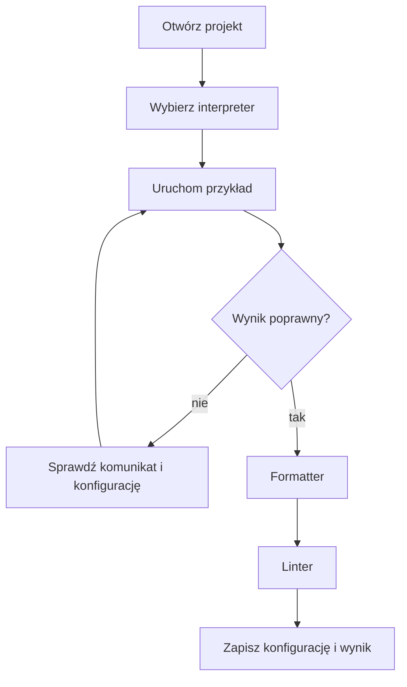

# 03. IDE, uruchamianie kodu i konfiguracja

## Cel

Student potrafi wybrać narzędzie adekwatne do zadania, otworzyć projekt, uruchomić prosty
program oraz odróżnić formatowanie od lintingu. Nie chodzi o zapamiętanie jednego IDE.
Chodzi o umiejętność znalezienia polecenia, ustawienia i komunikatu błędu.

## Porównanie IDE i edytora

| Narzędzie | Najmocniejszy obszar | Kiedy wybrać | Na co uważać |
| --- | --- | --- | --- |
| Visual Studio | duże aplikacje .NET i C++ na Windows | gdy projekt wymaga pełnego środowiska Microsoft | instalacja jest większa, a funkcje zależne od workloadu |
| Visual Studio Code | lekka praca z wieloma językami i plikami | gdy potrzebujesz elastycznego edytora i terminala | jakość zależy od dobranych rozszerzeń |
| IntelliJ IDEA | Java, Kotlin i bogate rozumienie projektu | gdy IDE ma analizować duży projekt JVM | funkcje webowe zależą od edycji i pluginów |
| Rider | .NET oraz praca cross-platform | gdy projekt korzysta z C# i ekosystemu .NET | część funkcji wymaga licencji lub konta JetBrains |

IDE oznacza zintegrowane środowisko programistyczne. VS Code jest przede wszystkim
rozszerzalnym edytorem, ale w praktyce może pełnić rolę lekkiego IDE.

## Co jest potrzebne

Do pierwszego uruchomienia potrzebujesz:

1. lokalnej kopii tego repozytorium,
2. zainstalowanego [Node.js w wersji LTS](https://nodejs.org/en/download),
3. jednego wybranego narzędzia: Visual Studio, Visual Studio Code, IntelliJ IDEA albo Rider,
4. terminala, który pozwala uruchomić polecenie `node`.

Do uruchomienia pliku `przyklad.js` nie potrzebujesz jeszcze `npm install`, frameworka ani
żadnej dodatkowej biblioteki. Instalacja pakietów będzie potrzebna dopiero do uruchomienia
formatowania i lintingu opisanych niżej.

## Uruchomienie krok po kroku

Poniższa procedura działa niezależnie od wybranego IDE. Zakłada, że terminal jest otwarty
w głównym katalogu repozytorium `warsztat-programisty-pjatk`.

### Krok 1: znajdź katalog przykładu

Plik uruchamiany na zajęciach znajduje się tutaj:

```text
src/01-organizacja/03-ide-i-konfiguracja/przyklad.js
```

W IDE otwórz jako projekt folder `03-ide-i-konfiguracja`, a nie pojedynczy plik.

### Krok 2: otwórz terminal w odpowiednim katalogu

Jeśli terminal zaczyna pracę w głównym katalogu repozytorium, przejdź do katalogu przykładu:

```text
cd .\src\01-organizacja\03-ide-i-konfiguracja
```

Możesz też uruchomić plik bez zmiany katalogu, podając pełną ścieżkę względną:

```text
node .\src\01-organizacja\03-ide-i-konfiguracja\przyklad.js
```

### Krok 3: sprawdź Node.js

Wpisz:

```text
node --version
npm --version
```

Jeśli oba polecenia wyświetlą numery wersji, środowisko jest dostępne. Numer wersji może
być inny niż na ekranie prowadzącego.

### Krok 4: uruchom program

Jeśli jesteś w katalogu `03-ide-i-konfiguracja`, wykonaj:

```text
node .\przyklad.js
```

Oczekiwany wynik to:

```text
7 + 5 = 12
```

Program został uruchomiony poprawnie, jeśli zobaczysz dokładnie ten tekst i terminal nie
zakończy polecenia komunikatem o błędzie.

### Krok 5: zapisz obserwację

W README swojego zadania zapisz:

- użyte IDE,
- wynik polecenia `node --version`,
- polecenie użyte do uruchomienia,
- otrzymany wynik.

## Instalacja i pierwszy start IDE

Korzystaj z instalatorów z oficjalnych stron. Podczas laboratorium prowadzący może
przygotować stanowiska wcześniej, ale student powinien umieć powtórzyć te kroki.

### Visual Studio

1. Otwórz [stronę pobierania Visual Studio](https://visualstudio.microsoft.com/downloads/).
2. Uruchom Visual Studio Installer.
3. Wybierz workload **Node.js development**, jeśli uruchamiasz przykład JavaScript,
   albo workload zgodny z projektem kursowym.
4. Otwórz folder projektu przez **Open a local folder**.
5. Otwórz terminal w IDE.
6. Wykonaj kroki 3-4 z sekcji **Uruchomienie krok po kroku**.

### Visual Studio Code

1. Zainstaluj [Visual Studio Code](https://code.visualstudio.com/download).
2. Otwórz folder przez **File -> Open Folder**.
3. Zainstaluj rozszerzenia: **EditorConfig for VS Code**, **Prettier - Code formatter**
   oraz **ESLint**.
4. Otwórz plik `przyklad.js` z tego katalogu.
5. Otwórz zintegrowany terminal.
6. Wykonaj kroki 3-4 z sekcji **Uruchomienie krok po kroku**.

### IntelliJ IDEA

1. Zainstaluj [IntelliJ IDEA](https://www.jetbrains.com/idea/download/).
2. Otwórz folder jako projekt.
3. Sprawdź w ustawieniach, czy obsługa JavaScript i Node.js jest dostępna w wybranej
  edycji; w razie potrzeby włącz odpowiedni plugin.
4. Wybierz zainstalowany Node.js w ustawieniach projektu.
5. Kliknij prawym przyciskiem `przyklad.js` i wybierz uruchomienie pliku albo otwórz
  terminal IDE.
6. Wykonaj kroki 3-4 z sekcji **Uruchomienie krok po kroku**.

### Rider

1. Zainstaluj [JetBrains Rider](https://www.jetbrains.com/rider/download/).
2. Otwórz folder projektu.
3. Sprawdź pluginy JavaScript/TypeScript i ustawienie interpretera Node.js.
4. Uruchom `przyklad.js` z menu kontekstowego albo otwórz terminal IDE.
5. Wykonaj kroki 3-4 z sekcji **Uruchomienie krok po kroku**.

Jeśli przy `node` pojawia się komunikat, że polecenie nie istnieje, problem dotyczy
instalacji lub PATH, a nie kodu. Node.js można pobrać z [oficjalnej strony](https://nodejs.org/en/download).

## Najczęstsze problemy

| Komunikat lub sytuacja | Przyczyna | Co zrobić |
| --- | --- | --- |
| `node is not recognized` albo podobny komunikat | Node.js nie jest zainstalowany lub nie ma go w PATH | Zainstaluj Node.js LTS, uruchom ponownie IDE i sprawdź `node --version` |
| `Cannot find module` albo brak pliku | Terminal jest w złym katalogu lub ścieżka jest literówką | Wykonaj `pwd`/`Get-Location`, przejdź do `03-ide-i-konfiguracja` i ponów polecenie |
| Program nic nie wyświetla | Uruchomiono inny plik albo usunięto `console.log` | Otwórz [przyklad.js](przyklad.js) i porównaj kod z przykładem poniżej |
| Wynik różni się od `7 + 5 = 12` | Zmieniono wartości zmiennych lub działanie | Przywróć wartości `7` i `5`, a następnie uruchom plik ponownie |

## Minimalny przykład

Kod znajduje się w pliku [przyklad.js](przyklad.js):

```javascript
const firstNumber = 7;
const secondNumber = 5;
const sum = firstNumber + secondNumber;

console.log(`${firstNumber} + ${secondNumber} = ${sum}`);
```

Oczekiwany wynik:

```text
7 + 5 = 12
```

Ten program pokazuje wartość zmiennej, operację matematyczną i wynik w terminalu. Do
pierwszego uruchomienia nie jest potrzebny framework ani dodatkowa biblioteka.

## Formatowanie a linting

- **Formatowanie** zmienia wygląd kodu: wcięcia, cudzysłowy, długość wiersza.
- **Linting** analizuje kod i sygnalizuje problemy, np. użycie niezdefiniowanej zmiennej
  albo pozostawioną zmienną, która nigdy nie jest używana.
- **Test** sprawdza zachowanie programu dla wybranego wejścia. Sam formatter ani linter
  nie dowodzi, że obliczenie jest poprawne.

Przykładowy plik `.editorconfig`:

```ini
root = true

[*]
charset = utf-8
end_of_line = lf
insert_final_newline = true
indent_style = space
indent_size = 2
```

Przykładowe skrypty projektu w `package.json`:

```json
{
  "scripts": {
    "format": "prettier --write .",
    "format:check": "prettier --check .",
    "lint": "eslint ."
  }
}
```

Po zainstalowaniu narzędzi w projekcie polecenia wyglądają tak:

```text
npm install --save-dev prettier eslint
npx prettier --check przyklad.js
npx prettier --write przyklad.js
npx eslint przyklad.js
```

Nie trzeba uruchamiać wszystkich poleceń jednocześnie. Najpierw sprawdź kod, potem
sformatuj go, a na końcu ponownie uruchom linter i program.

## Zadanie dla studenta

1. Wybierz jedno z czterech narzędzi i otwórz ten katalog jako projekt.
2. Uruchom [przyklad.js](przyklad.js) i zapisz wynik.
3. Zmień wartość `firstNumber` na `9`.
4. Dodaj w kodzie celowy błąd: odwołaj się do `thirdNumber`, która nie istnieje.
5. Uruchom linter lub przeczytaj komunikat IDE.
6. Napraw błąd, sformatuj plik i uruchom program ponownie.
7. W swoim README zapisz: wybrane IDE, nazwę rozszerzenia, polecenie uruchomienia,
   komunikat błędu i oczekiwany wynik po naprawie.

### Rozwiązanie i wyjaśnienie

Po naprawie plik powinien nadal korzystać tylko ze zdefiniowanych zmiennych:

```javascript
const firstNumber = 9;
const secondNumber = 5;
const sum = firstNumber + secondNumber;

console.log(`${firstNumber} + ${secondNumber} = ${sum}`);
```

Wynik to `9 + 5 = 14`. Linter powinien zgłosić odwołanie do `thirdNumber`, bo nie ma
jej definicji w zakresie programu. Samo sformatowanie pliku nie naprawia tego błędu:
formatowanie zmienia zapis, a linting pomaga znaleźć podejrzany zapis.

## Diagram



Źródło diagramu: [uruchomienie i konfiguracja IDE](diagramy/uruchomienie-ide.mmd).
