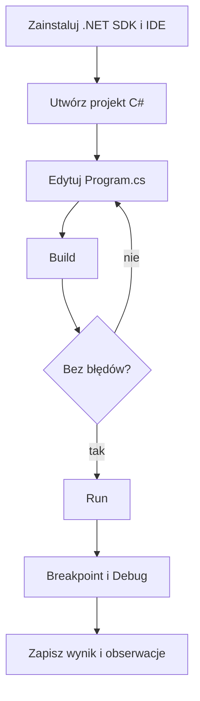

# 03. IDE, C# i .NET

## Cel

Po wykonaniu instrukcji student potrafi przygotować środowisko .NET, utworzyć i edytować
projekt C#, zbudować go, uruchomić oraz znaleźć błąd przy użyciu debuggera. Na zajęciach
korzystamy z **Visual Studio Code**, **Visual Studio** lub **JetBrains Rider**.

Ten materiał uzupełnia zajęcia z Podstaw programowania. Zakłada, że podstawy języka C#
student ćwiczy na tamtych zajęciach; tutaj poznaje narzędzia i cykl pracy nad projektem.

## Przygotowanie wspólne

1. Zainstaluj **.NET SDK** wskazany przez prowadzącego z
   [oficjalnej strony .NET](https://dotnet.microsoft.com/download). Sam runtime nie
   wystarczy do tworzenia i kompilowania projektów.
2. Otwórz terminal i sprawdź instalację:

   ```text
   dotnet --info
   dotnet --list-sdks
   ```

   Polecenie powinno wyświetlić informacje o SDK. Jeśli `dotnet` nie jest rozpoznawane,
   zainstaluj SDK i uruchom ponownie terminal lub IDE.
3. We wszystkich trzech IDE wykonasz to samo ćwiczenie: utwórz aplikację konsolową
   `HelloWorkshop`, zmień tekst w `Program.cs`, zbuduj i uruchom projekt, a potem zatrzymaj
   program na breakpointcie.

## Visual Studio Code

VS Code jest lekkim, rozszerzalnym edytorem. Obsługę projektu .NET zapewnia rozszerzenie
C# Dev Kit.

1. Pobierz i zainstaluj [Visual Studio Code](https://code.visualstudio.com/download).
2. Otwórz widok **Extensions** (`Ctrl+Shift+X`), znajdź rozszerzenie **C# Dev Kit**
   wydane przez Microsoft i zainstaluj je.
3. Utwórz projekt z terminala:

   ```text
   dotnet new console --name HelloWorkshop
   cd HelloWorkshop
   code .
   ```

   Jeśli polecenie `code` nie jest dostępne, uruchom VS Code i wybierz **File → Open Folder**,
   a następnie wskaż katalog `HelloWorkshop`.
4. Otwórz `Program.cs`. Zmień tekst w `Console.WriteLine`, na przykład na:

   ```csharp
   Console.WriteLine("Hello, Warsztacie Programisty!");
   ```

   Zapisz plik.
5. Otwórz terminal w VS Code (**Terminal → New Terminal**) i wykonaj kolejno:

   ```text
   dotnet build
   dotnet run
   ```

   `dotnet build` kompiluje projekt, a `dotnet run` buduje go w razie potrzeby i uruchamia.
   W terminalu powinien pojawić się zmieniony tekst.
6. Kliknij lewy margines obok linii `Console.WriteLine`, aby dodać breakpoint. Otwórz
   **Run and Debug**, wybierz konfigurację C#/.NET, jeśli zostanie zaproponowana, i naciśnij
   `F5`. Program powinien zatrzymać się na breakpointcie. Obejrzyj panel **Variables**,
   a potem użyj **Continue** lub `F5`, aby dokończyć program.

Dokumentacja: [C# w VS Code](https://code.visualstudio.com/docs/csharp/get-started).

## Visual Studio

Visual Studio to pełne IDE dla Windows. Do aplikacji konsolowej C# potrzebny jest workload
.NET.

1. Pobierz [Visual Studio Community](https://visualstudio.microsoft.com/vs/community/).
2. W **Visual Studio Installer** zaznacz workload **.NET desktop development** i wybierz
   **Install** lub **Modify**. Po zakończeniu uruchom Visual Studio.
3. Wybierz **Create a new project**, wskaż szablon **Console App** dla języka C# i kliknij
   **Next**. Wpisz nazwę `HelloWorkshop`, wybierz katalog i kliknij **Next**.
4. Wybierz framework dostępny w instalacji i zatwierdź **Create**.
5. Otwórz `Program.cs`, zmień tekst w `Console.WriteLine` na
   `Hello, Warsztacie Programisty!` i zapisz plik.
6. Wybierz **Build → Build Solution** (`Ctrl+Shift+B`). Po poprawnym zbudowaniu uruchom
   program bez debugowania przez **Debug → Start Without Debugging** (`Ctrl+F5`).
   W oknie konsoli powinien pojawić się zmieniony tekst.
7. Kliknij margines obok `Console.WriteLine`, aby ustawić breakpoint. Uruchom debugowanie
   przez **Debug → Start Debugging** (`F5`). Gdy wykonanie się zatrzyma, obejrzyj zmienne
   w oknie **Locals** i użyj **Continue** (`F5`), aby kontynuować.

Dokumentacja: [tworzenie aplikacji konsolowej w Visual Studio](https://learn.microsoft.com/dotnet/core/tutorials/with-visual-studio).

## JetBrains Rider

Rider jest wieloplatformowym IDE dla .NET. Wymaga zainstalowanego .NET SDK.

1. Pobierz i zainstaluj [JetBrains Rider](https://www.jetbrains.com/rider/download/).
2. Uruchom Rider. Na ekranie startowym wybierz **New Solution**, a następnie szablon
   **Console Application** dla C#. Ustaw nazwę `HelloWorkshop`, lokalizację i dostępny
   framework .NET; utwórz rozwiązanie.
3. Otwórz `Program.cs`, zmień tekst w `Console.WriteLine` na
   `Hello, Warsztacie Programisty!` i zapisz plik.
4. Wybierz **Build → Build Solution**. Następnie uruchom projekt przez **Run → Run** lub
   przycisk uruchamiania przy konfiguracji `HelloWorkshop`. W oknie **Run** powinien
   pojawić się zmieniony tekst.
5. Kliknij margines obok `Console.WriteLine`, aby dodać breakpoint. Wybierz **Run → Debug**
   lub uruchom konfigurację przyciskiem debugowania. Gdy program się zatrzyma, sprawdź
   zmienne w oknie debuggera i użyj **Resume Program**, aby kontynuować.

Możesz też otworzyć katalog z plikiem `.csproj` przez **File → Open**. Dokumentacja:
[pierwsze kroki w Riderze](https://www.jetbrains.com/help/rider/Getting_Started.html).

## Ten sam cykl pracy w każdym IDE

| Etap | Polecenie lub czynność | Co potwierdza poprawność |
| --- | --- | --- |
| Utworzenie | szablon Console App lub `dotnet new console` | istnieją `Program.cs` i plik `.csproj` |
| Edycja | zmiana tekstu w `Console.WriteLine` | plik jest zapisany |
| Kompilacja | `dotnet build` lub polecenie **Build** IDE | kompilacja kończy się bez błędów |
| Uruchomienie | `dotnet run` lub polecenie **Run** IDE | widać nowy tekst w konsoli |
| Debugowanie | breakpoint i **Debug** / `F5` | wykonanie zatrzymuje się na wskazanej linii |

Plik `.csproj` opisuje projekt i jego ustawienia. Foldery `bin/` i `obj/` zawierają
wyniki i pliki pośrednie budowania; nie edytuj ich ręcznie i nie dodawaj ich do Git.

## Najczęstsze problemy

| Sytuacja | Co sprawdzić |
| --- | --- |
| `dotnet` nie jest rozpoznawane | Czy zainstalowano SDK, a nie tylko runtime? Uruchom nowy terminal i ponów `dotnet --info`. |
| IDE nie pokazuje projektu C# | Otwórz katalog zawierający plik `.csproj`, a nie tylko pojedynczy plik źródłowy. |
| Build zgłasza błędy | Przeczytaj pierwszą diagnostykę, sprawdź numer linii w `Program.cs` i zapisz plik przed kolejną próbą. |
| Breakpoint nie zatrzymuje programu | Uruchom konfigurację **Debug**, a nie **Run without debugging**, i sprawdź, czy linia zostaje wykonana. |
| Zmiany nie pojawiają się w wyniku | Zapisz `Program.cs`, uruchom właściwy projekt i sprawdź katalog roboczy/konfigurację uruchomieniową. |

## Zadanie dla studenta

W jednym wybranym IDE wykonaj ćwiczenie, a następnie powtórz je w drugim:

1. Utwórz projekt konsolowy `HelloWorkshop`.
2. Zmień komunikat tak, aby zawierał swoje imię lub pseudonim.
3. Zbuduj i uruchom aplikację. Zapisz polecenie lub użyte pozycje menu oraz wynik.
4. Ustaw breakpoint na instrukcji wyświetlającej tekst i uruchom debugowanie.
5. Zmień tekst ponownie, uruchom aplikację i sprawdź, czy wynik odpowiada zmianie.
6. W README zadania podaj użyte IDE, wersję SDK z `dotnet --version`, wynik budowania
   i uruchamiania oraz co udało się sprawdzić w debuggerze.

## Diagram


```mermaid
flowchart TD
    A[Zainstaluj .NET SDK i IDE] --> B[Utwórz projekt C#]
    B --> C[Edytuj Program.cs]
    C --> D[Build]
    D --> E{Bez błędów?}
    E -- nie --> C
    E -- tak --> F[Run]
    F --> G[Breakpoint i Debug]
    G --> H[Zapisz wynik i obserwacje]
```

Źródło diagramu: [cykl uruchomienia IDE](diagramy/uruchomienie-ide.mmd).
