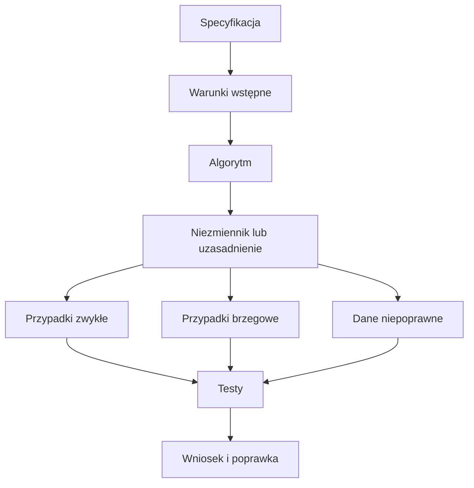

# 04. Proste obliczenia, poprawność algorytmu i testy

## Cel

Student potrafi:

- zapisać algorytm jako uporządkowaną procedurę,
- nazwać założenia, warunki wstępne i oczekiwany rezultat,
- dobrać przypadki zwykłe, brzegowe i niepoprawne,
- wykonać test ręczny oraz zapisać test automatyczny,
- wyjaśnić, dlaczego pokrycie kodu pomaga, ale nie jest dowodem pełnej poprawności.

Przykłady w tym temacie są w JavaScripcie, ale można je przepisać na pseudokod lub inny
język. Składnia nie jest celem zajęć.

## Pięć algorytmów

| Algorytm | Warunek wstępny | Przykład | Co sprawdzić |
| --- | --- | --- | --- |
| Pole prostokąta | boki są liczbami nieujemnymi | `4, 3 -> 12` | zero, liczby ułamkowe, dane ujemne |
| Średnia | lista zawiera co najmniej jedną liczbę | `[2, 4, 6] -> 4` | jedna wartość, wynik ułamkowy, pusta lista |
| Silnia | `n` jest całkowite i `n >= 0` | `5 -> 120` | `0`, `1`, liczba ujemna, ułamkowa |
| Największy wspólny dzielnik | argumenty są całkowite i nie są jednocześnie zerami | `18, 24 -> 6` | zero, liczby ujemne, liczby względnie pierwsze |
| Liczba pierwsza | argument jest liczbą całkowitą | `17 -> true` | `0`, `1`, `2`, dzielnik, duża liczba |

Gotowe implementacje są w pliku [algorytmy.js](algorytmy.js), a przykładowe kontrole w
[algorytmy-manual.test.js](algorytmy-manual.test.js).

## Jak rozumieć poprawność

Samo otrzymanie oczekiwanej liczby dla jednego przykładu nie wystarcza. Dla algorytmu
warto zapisać:

1. **Warunek wstępny** - jakie dane wolno podać?
2. **Specyfikacja** - jaki wynik obiecujemy dla poprawnych danych?
3. **Kroki algorytmu** - co wykonujemy i w jakiej kolejności?
4. **Niezmiennik** - jaka własność pozostaje prawdziwa w każdym obrocie pętli?
5. **Warunek końcowy** - po czym poznajemy, że rezultat jest gotowy?

Dla algorytmu NWD pętla zachowuje własność: `nwd(a, b) = nwd(b, a mod b)`. Gdy reszta
z dzielenia staje się zerem, pozostała liczba jest wynikiem. Testy mogą pokazać, że
implementacja zachowuje się dobrze dla wybranych danych; argument o niezmienniku wyjaśnia,
dlaczego metoda ma działać dla całej opisanej klasy danych.

### Przykład pseudokodu: silnia

```text
wejście: n, liczba całkowita n >= 0
wynik = 1
powtarzaj dla liczb od 2 do n:
  wynik = wynik * aktualna liczba
zwróć wynik
```

Dla `n = 0` pętla nie wykonuje obrotu, a wynik `1` jest zgodny z definicją silni zera.
To jest przypadek brzegowy, który łatwo pominąć przy kontroli tylko dla `n = 5`.

## Przypadki testowe

| Funkcja | Zwykły | Brzegowy | Niepoprawny lub ryzykowny |
| --- | --- | --- | --- |
| `poleProstokata` | `4, 3 -> 12` | `0, 4 -> 0` | `-1, 4 -> błąd` |
| `srednia` | `[2, 4, 6] -> 4` | `[8] -> 8` | `[] -> błąd` |
| `silnia` | `5 -> 120` | `0 -> 1` | `-1 -> błąd` |
| `nwd` | `18, 24 -> 6` | `0, 9 -> 9` | `0, 0 -> błąd` |
| `czyPierwsza` | `17 -> true` | `2 -> true` | `1 -> false` |

**Test ręczny** oznacza, że osoba wybiera dane, uruchamia program i porównuje rezultat
z oczekiwaniem. Jest szybki i dobry na początku. Nie zostawia jednak stałego zapisu,
łatwo pominąć przypadek i trudniej powtórzyć kontrolę po zmianie kodu.

**Test automatyczny** zapisuje dane, oczekiwanie i warunek porównania w pliku. Można go
powtarzać po każdej zmianie. Nie zwalnia to z zaprojektowania dobrych przypadków.

## Uruchomienie

W terminalu otwartym w tym katalogu wykonaj:

```text
node algorytmy-manual.test.js
```

Oczekiwany wynik:

```text
Wszystkie przykładowe testy zakończyły się powodzeniem.
```

Jeśli pojawi się błąd asercji, przeczytaj nazwę funkcji i dane z komunikatu. Nie zmieniaj
oczekiwanego wyniku tylko po to, aby test przeszedł. Najpierw sprawdź specyfikację zadania.

## Co daje pokrycie kodu

Pokrycie informuje, jaka część kodu została wykonana przez testy. Na początku można
rozróżnić:

- **pokrycie instrukcji** - czy wykonano daną instrukcję,
- **pokrycie gałęzi** - czy warunek miał wynik prawda i fałsz,
- **pokrycie przypadków** - czy sprawdzono klasy danych, np. zero i liczbę ujemną.

Wysokie pokrycie nie dowodzi, że oczekiwania są prawidłowe. Test może wykonać linię,
ale porównywać z błędną wartością. Z kolei niskie pokrycie często wskazuje, że jakaś
gałąź, błąd lub przypadek brzegowy nie został przemyślany. Pokrycie jest sygnałem do
rozmowy i narzędziem do znalezienia luk, nie jedyną miarą jakości.

## Zadanie 1: nowy algorytm

Dodaj funkcję `poleTrojkata(podstawa, wysokosc)`:

1. Przyjmij liczby nieujemne.
2. Dla poprawnych danych zwróć `podstawa * wysokosc / 2`.
3. Dla wartości ujemnej zgłoś błąd.
4. Dodaj co najmniej jeden przypadek zwykły, brzegowy i niepoprawny.
5. Uruchom cały plik testów.

### Rozwiązanie 1

```javascript
function poleTrojkata(podstawa, wysokosc) {
  if (podstawa < 0 || wysokosc < 0) {
    throw new RangeError("Boki nie mogą być ujemne");
  }
  return (podstawa * wysokosc) / 2;
}
```

Przykładowe sprawdzenia:

```javascript
assert.equal(poleTrojkata(4, 3), 6);
assert.equal(poleTrojkata(0, 3), 0);
assert.throws(() => poleTrojkata(-1, 3), RangeError);
```

Wymaganie o danych liczbowych można rozszerzyć tak, jak zrobiono to w pozostałych
funkcjach. Najważniejsze jest, aby warunek wstępny był jawny i miał odpowiadający mu test.

## Zadanie 2: szukanie luki

Przejrzyj testy dla `czyPierwsza` i dopisz przypadki:

- `3`,
- `4`,
- `25`,
- liczby ujemnej.

Następnie odpowiedz: które gałęzie kodu uruchamiają te przypadki?

### Rozwiązanie 2

```javascript
assert.equal(czyPierwsza(3), true);
assert.equal(czyPierwsza(4), false);
assert.equal(czyPierwsza(25), false);
assert.equal(czyPierwsza(-7), false);
```

`3` przechodzi pętlę bez znalezienia dzielnika, `4` kończy ją na dzielniku `2`, `25`
sprawdza dzielnik większy niż `2`, a liczba ujemna korzysta z warunku `number < 2`.
Razem testy obejmują różne wyjścia warunków, a nie tylko kilka kolejnych liczb.

## Zadanie 3: zmiana implementacji

W kopii funkcji `srednia` zamień dzielenie przez `values.length` na dzielenie przez
`values.length - 1`. Uruchom testy i zapisz, który przypadek wykrył błąd. Przywróć poprawną
implementację.

### Rozwiązanie 3

Test `[2, 4, 6] -> 4` wykrywa zmianę, bo błędna wersja zwróci `6`. To przykład testu,
który nie tylko wykonuje kod, ale ma niezależne, poprawne oczekiwanie. Test dla jednej
wartości jest dodatkowo ważny, bo pokazuje ryzyko dzielenia przez zero w błędnej wersji.

## Diagramy



Źródło diagramu: [proces sprawdzania poprawności](diagramy/poprawnosc-algorytmu.mmd).


Źródło diagramu: [pokrycie i luki testów](diagramy/pokrycie-testami.mmd).
