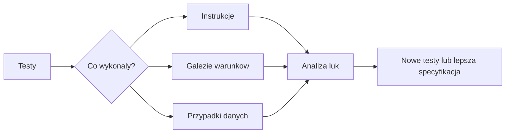

# 04. Proste obliczenia, poprawność algorytmu i testy

## Cel

Student potrafi:

- zapisac algorytm jako uporzadkowana procedure,
- nazwac zalozenia, warunki wstepne i oczekiwany rezultat,
- dobrac przypadki zwykle, brzegowe i niepoprawne,
- wykonac test reczny oraz zapisac test automatyczny,
- wyjasnic, dlaczego pokrycie kodu pomaga, ale nie jest dowodem pelnej poprawnosci.

Przyklady w tym temacie sa w JavaScripcie, ale mozna je przepisac na pseudokod lub inny
jezyk. Skladnia nie jest celem zajec.

## Piec algorytmow

| Algorytm | Warunek wstepny | Przyklad | Co sprawdzic |
| --- | --- | --- | --- |
| Pole prostokata | boki sa liczbami nieujemnymi | `4, 3 -> 12` | zero, liczby ulamkowe, dane ujemne |
| Srednia | lista zawiera co najmniej jedna liczbe | `[2, 4, 6] -> 4` | jedna wartosc, wynik ulamkowy, pusta lista |
| Silnia | `n` jest calkowite i `n >= 0` | `5 -> 120` | `0`, `1`, liczba ujemna, ulamkowa |
| Najwiekszy wspolny dzielnik | argumenty sa calkowite i nie sa jednoczesnie zerami | `18, 24 -> 6` | zero, liczby ujemne, liczby wzglednie pierwsze |
| Liczba pierwsza | argument jest liczba calkowita | `17 -> true` | `0`, `1`, `2`, dzielnik, duza liczba |

Gotowe implementacje sa w pliku [algorytmy.js](algorytmy.js), a przykladowe kontrole w
[algorytmy-manual.test.js](algorytmy-manual.test.js).

## Jak rozumiec poprawność

Samo otrzymanie oczekiwanej liczby dla jednego przykladu nie wystarcza. Dla algorytmu
warto zapisac:

1. **Warunek wstepny** - jakie dane wolno podac?
2. **Specyfikacje** - jaki wynik obiecujemy dla poprawnych danych?
3. **Kroki algorytmu** - co wykonujemy i w jakiej kolejnosci?
4. **Niezmiennik** - jaka wlasnosc pozostaje prawdziwa w kazdym obrocie petli?
5. **Warunek koncowy** - po czym poznajemy, ze rezultat jest gotowy?

Dla algorytmu NWD petla zachowuje wlasnosc: `nwd(a, b) = nwd(b, a mod b)`. Gdy reszta
z dzielenia staje sie zerem, pozostala liczba jest wynikiem. Testy moga pokazac, ze
implementacja zachowuje sie dobrze dla wybranych danych; argument o niezmienniku wyjasnia,
dlaczego metoda ma dzialac dla calej opisanej klasy danych.

### Przyklad pseudokodu: silnia

```text
wejscie: n, liczba calkowita n >= 0
wynik = 1
powtarzaj dla liczb od 2 do n:
    wynik = wynik * aktualna liczba
zwróć wynik
```

Dla `n = 0` petla nie wykonuje obrotu, a wynik `1` jest zgodny z definicja silni zera.
To jest przypadek brzegowy, ktory latwo pominac przy kontroli tylko dla `n = 5`.

## Przypadki testowe

| Funkcja | Zwykly | Brzegowy | Niepoprawny lub ryzykowny |
| --- | --- | --- | --- |
| `poleProstokata` | `4, 3 -> 12` | `0, 4 -> 0` | `-1, 4 -> blad` |
| `srednia` | `[2, 4, 6] -> 4` | `[8] -> 8` | `[] -> blad` |
| `silnia` | `5 -> 120` | `0 -> 1` | `-1 -> blad` |
| `nwd` | `18, 24 -> 6` | `0, 9 -> 9` | `0, 0 -> blad` |
| `czyPierwsza` | `17 -> true` | `2 -> true` | `1 -> false` |

**Test reczny** oznacza, ze osoba wybiera dane, uruchamia program i porownuje rezultat
z oczekiwaniem. Jest szybki i dobry na poczatku. Nie zostawia jednak stalego zapisu,
latwo pominac przypadek i trudniej powtorzyc kontrole po zmianie kodu.

**Test automatyczny** zapisuje dane, oczekiwanie i warunek porownania w pliku. Mozna go
powtarzac po kazdej zmianie. Nie zwalnia to z zaprojektowania dobrych przypadkow.

## Uruchomienie

W terminalu otwartym w tym katalogu wykonaj:

```text
node algorytmy-manual.test.js
```

Oczekiwany wynik:

```text
Wszystkie przykladowe testy zakonczyly sie powodzeniem.
```

Jesli pojawi sie blad asercji, przeczytaj nazwe funkcji i dane z komunikatu. Nie zmieniaj
oczekiwanego wyniku tylko po to, aby test przeszedl. Najpierw sprawdz specyfikacje zadania.

## Co daje pokrycie kodu

Pokrycie informuje, jaka czesc kodu zostala wykonana przez testy. Na poczatku mozna
rozroznic:

- **pokrycie instrukcji** - czy wykonano dana instrukcje,
- **pokrycie galezi** - czy warunek mial wynik prawda i falsz,
- **pokrycie przypadkow** - czy sprawdzono klasy danych, np. zero i liczbe ujemna.

Wysokie pokrycie nie dowodzi, ze oczekiwania sa prawidlowe. Test moze wykonac linie,
ale porownywac z bledna wartoscia. Z kolei niskie pokrycie czesto wskazuje, ze jakas
galaz, blad lub przypadek brzegowy nie zostal przemyslany. Pokrycie jest sygnalem do
rozmowy i narzedziem do znalezienia luk, nie jedyna miara jakosci.

## Zadanie 1: nowy algorytm

Dodaj funkcje `poleTrojkata(podstawa, wysokosc)`:

1. Przyjmij liczby nieujemne.
2. Dla poprawnych danych zwroc `podstawa * wysokosc / 2`.
3. Dla wartosci ujemnej zglos blad.
4. Dodaj co najmniej jeden przypadek zwykly, brzegowy i niepoprawny.
5. Uruchom caly plik testow.

### Rozwiazanie 1

```javascript
function poleTrojkata(podstawa, wysokosc) {
  if (podstawa < 0 || wysokosc < 0) {
    throw new RangeError("Boki nie moga byc ujemne");
  }
  return (podstawa * wysokosc) / 2;
}
```

Przykladowe sprawdzenia:

```javascript
assert.equal(poleTrojkata(4, 3), 6);
assert.equal(poleTrojkata(0, 3), 0);
assert.throws(() => poleTrojkata(-1, 3), RangeError);
```

Wymaganie o danych liczbowych mozna rozszerzyc tak, jak zrobiono to w pozostalych
funkcjach. Najwazniejsze jest, aby warunek wstepny byl jawny i mial odpowiadajacy mu test.

## Zadanie 2: szukanie luki

Przejrzyj testy dla `czyPierwsza` i dopisz przypadki:

- `3`,
- `4`,
- `25`,
- liczby ujemnej.

Nastepnie odpowiedz: ktore galezie kodu uruchamiaja te przypadki?

### Rozwiazanie 2

```javascript
assert.equal(czyPierwsza(3), true);
assert.equal(czyPierwsza(4), false);
assert.equal(czyPierwsza(25), false);
assert.equal(czyPierwsza(-7), false);
```

`3` przechodzi petle bez znalezienia dzielnika, `4` konczy ja na dzielniku `2`, `25`
sprawdza dzielnik wiekszy niz `2`, a liczba ujemna korzysta z warunku `number < 2`.
Razem testy obejmuja rozne wyjscia warunkow, a nie tylko kilka kolejnych liczb.

## Zadanie 3: zmiana implementacji

W kopii funkcji `srednia` zamien dzielenie przez `values.length` na dzielenie przez
`values.length - 1`. Uruchom testy i zapisz, ktory przypadek wykryl blad. Przywroc poprawna
implementacje.

### Rozwiazanie 3

Test `[2, 4, 6] -> 4` wykrywa zmiane, bo bledna wersja zwroci `6`. To przyklad testu,
ktory nie tylko wykonuje kod, ale ma niezalezne, poprawne oczekiwanie. Test dla jednej
wartosci jest dodatkowo wazny, bo pokazuje ryzyko dzielenia przez zero w blednej wersji.

## Diagramy


Zrodlo diagramu: [proces sprawdzania poprawnosci](diagramy/poprawnosc-algorytmu.mmd).



Zrodlo diagramu: [pokrycie i luki testow](diagramy/pokrycie-testami.mmd).
