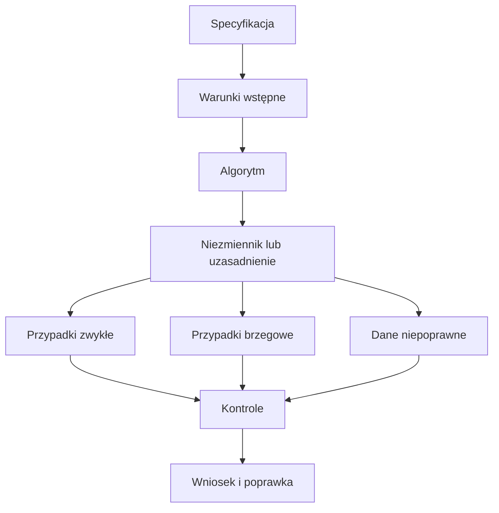
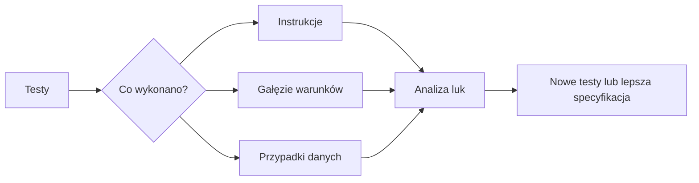

# 04. Obliczenia, poprawność algorytmu i testy

## Cel

Student potrafi:

- zapisać algorytm jako uporządkowaną procedurę,
- nazwać założenia, warunki wstępne i oczekiwany rezultat,
- dobrać przypadki zwykłe, brzegowe i niepoprawne,
- uruchomić proste kontrole w C#,
- wyjaśnić, dlaczego wykonanie przykładowych przypadków pomaga, ale samo nie dowodzi
  pełnej poprawności.

Temat uzupełnia ćwiczenia algorytmiczne z Podstaw programowania. Nie wprowadza ponownie
składni C#; skupia się na specyfikacji, doborze danych i sprawdzeniu wyniku.

## Przykładowe algorytmy i przypadki

| Algorytm | Warunek wstępny | Przykład | Co sprawdzić |
| --- | --- | --- | --- |
| Pole prostokąta | boki są skończonymi liczbami nieujemnymi | `4, 3 -> 12` | zero, ułamki, dane ujemne |
| Średnia | lista zawiera co najmniej jedną skończoną liczbę | `[2, 4, 6] -> 4` | jedna wartość, wynik ułamkowy, pusta lista |
| Silnia | `n` jest całkowite i `0 <= n <= 20` | `5 -> 120` | `0`, `1`, liczba ujemna, przepełnienie |
| Największy wspólny dzielnik | argumenty są całkowite i nie są jednocześnie zerami | `18, 24 -> 6` | zero, liczby ujemne, liczby względnie pierwsze |
| Liczba pierwsza | argument jest liczbą całkowitą | `17 -> true` | `0`, `1`, `2`, dzielnik, liczba ujemna |

Implementacje znajdują się w [Algorytmy.cs](Algorytmy.cs), a przykładowe asercje
w [Program.cs](Program.cs). Projekt nie wymaga zewnętrznych pakietów testowych.

## Jak myśleć o poprawności

Dla każdego algorytmu zapisz:

1. **Warunek wstępny** — jakie dane wolno podać?
2. **Specyfikację** — jaki wynik obiecujemy dla poprawnych danych?
3. **Kroki algorytmu** — co wykonujemy i w jakiej kolejności?
4. **Niezmiennik lub uzasadnienie** — dlaczego kolejne kroki zachowują własność potrzebną
   do uzyskania wyniku?
5. **Warunek końcowy** — po czym poznajemy, że rezultat jest gotowy?

Dla algorytmu NWD pętla zachowuje własność `nwd(a, b) = nwd(b, a mod b)`. Gdy reszta
z dzielenia staje się zerem, pozostała liczba jest wynikiem. Testy pokazują zachowanie
implementacji dla wybranych danych; uzasadnienie wyjaśnia, dlaczego metoda działa w całym
opisanym zakresie.

## Przypadki kontrolne

| Funkcja | Zwykły | Brzegowy | Niepoprawny lub ryzykowny |
| --- | --- | --- | --- |
| `PoleProstokata` | `4, 3 -> 12` | `0, 4 -> 0` | `-1, 4 -> błąd` |
| `Srednia` | `[2, 4, 6] -> 4` | `[8] -> 8` | `[] -> błąd` |
| `Silnia` | `5 -> 120` | `0 -> 1` | `-1 -> błąd` |
| `Nwd` | `18, 24 -> 6` | `0, 9 -> 9` | `0, 0 -> błąd` |
| `CzyPierwsza` | `17 -> true` | `2 -> true` | `1 -> false` |

**Kontrola ręczna** polega na podaniu danych, uruchomieniu programu i porównaniu wyniku
z oczekiwaniem. **Test automatyczny** utrwala dane i warunek porównania w kodzie, więc
można go szybko powtórzyć po zmianie. W obu przypadkach jakość zależy od tego, czy
oczekiwany wynik wynika ze specyfikacji.

## Uruchomienie

W terminalu otwartym w tym katalogu wykonaj:

```text
dotnet run
```

Oczekiwany komunikat na końcu:

```text
Wszystkie przykładowe testy zakończyły się powodzeniem.
```

Polecenie `dotnet run` buduje i uruchamia projekt. Gdy kontrola się nie powiedzie,
program kończy się wyjątkiem wskazującym asercję; nie zmieniaj oczekiwanego wyniku tylko
po to, aby test przeszedł.

## Co mówią testy i pokrycie

Test pomaga wykryć różnicę między wynikiem oczekiwanym a otrzymanym. Warto obejmować
przypadki zwykłe, graniczne, różne wyniki warunków i dane spoza dziedziny. Pokrycie
instrukcji lub gałęzi informuje, jaka część kodu została wykonana, ale nie sprawdza,
czy oczekiwania są prawidłowe. Wysokie pokrycie nie jest dowodem poprawności.

## Zadanie 1: nowe obliczenie

Dodaj metodę `PoleTrojkata(podstawa, wysokosc)`:

1. Przyjmij skończone liczby nieujemne.
2. Zwróć `podstawa * wysokosc / 2`.
3. Dla wartości ujemnej lub nieskończonej zgłoś wyjątek argumentu.
4. Dodaj przypadek zwykły (`4, 3 -> 6`), brzegowy (`0, 3 -> 0`) i niepoprawny.
5. Uruchom cały projekt.

Przykładowa implementacja:

```csharp
public static double PoleTrojkata(double podstawa, double wysokosc)
{
    if (!double.IsFinite(podstawa) || !double.IsFinite(wysokosc))
    {
        throw new ArgumentException("Wymiary muszą być skończonymi liczbami.");
    }

    if (podstawa < 0 || wysokosc < 0)
    {
        throw new ArgumentOutOfRangeException(nameof(podstawa), "Wymiary nie mogą być ujemne.");
    }

    return podstawa * wysokosc / 2;
}
```

## Zadanie 2: znajdź lukę w przypadkach

Dopisz do kontroli `CzyPierwsza` przypadki `3`, `4`, `25` i `-7`. Wskaż, które warunki
lub obroty pętli obejmuje każdy przypadek. Czy testy rozróżniają liczbę pierwszą,
złożoną, brzegową i ujemną?

## Zadanie 3: sprawdź, czy test wykrywa błąd

W kopii metody `Srednia` zamień dzielenie przez liczbę elementów na dzielenie przez
`liczba elementów - 1`. Uruchom kontrole i zapisz, który przypadek wykrył błąd. Przywróć
poprawną implementację. Nie zostawiaj celowo błędnej wersji w oddawanej pracy.

## Diagram


```mermaid
flowchart TD
    A[Specyfikacja] --> B[Warunki wstępne]
    B --> C[Algorytm]
    C --> D[Niezmiennik lub uzasadnienie]
    D --> E[Przypadki zwykłe]
    D --> F[Przypadki brzegowe]
    D --> G[Dane niepoprawne]
    E --> H[Kontrole]
    F --> H
    G --> H
    H --> I[Wniosek i poprawka]
```

Źródło diagramu: [proces sprawdzania poprawności](diagramy/poprawnosc-algorytmu.mmd).


```mermaid
flowchart LR
    A[Testy] --> B{Co wykonano?}
    B --> C[Instrukcje]
    B --> D[Gałęzie warunków]
    B --> E[Przypadki danych]
    C --> F[Analiza luk]
    D --> F
    E --> F
    F --> G[Nowe testy lub lepsza specyfikacja]
```

Źródło diagramu: [pokrycie i luki testów](diagramy/pokrycie-testami.mmd).
