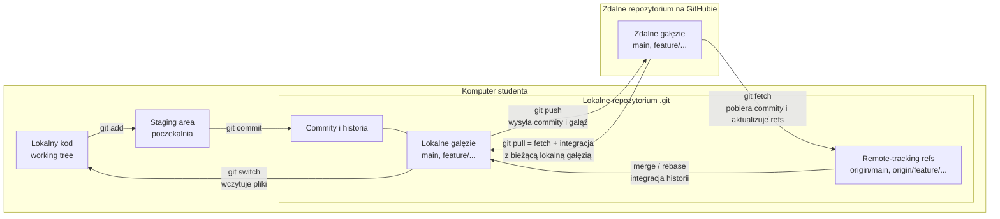
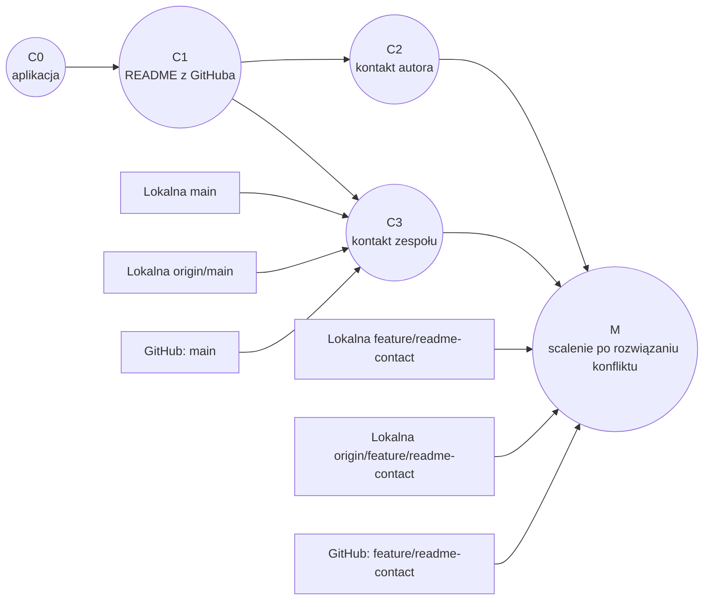
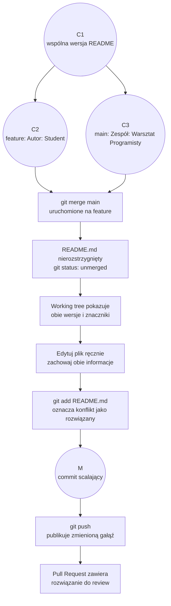

# 05. Laboratorium: środowisko pracy, Git i Pull Request

## Cel

Samodzielnie przejdź drogę od pustego katalogu do projektu C#/.NET umieszczonego w zdalnym
repozytorium. Następnie wykonaj pracę na gałęzi, otwórz Pull Request i rozwiąż kontrolowany
konflikt scalania.

Instrukcja łączy ćwiczenia z laboratoriów
[01. Środowisko pracy i Git](https://pjmpr.github.io/WARP2627/laboratoria/lab-01.html)
oraz
[02. Branch, konflikt i Pull Request](https://pjmpr.github.io/WARP2627/laboratoria/lab-02.html).
Pracuj we własnym repozytorium, nie w repozytorium kursowym.

## Przygotowanie

Potrzebujesz:

- zainstalowanego .NET SDK i jednego z IDE: VS Code, Visual Studio lub Rider;
- Git zainstalowanego lokalnie;
- konta GitHub oraz przeglądarki internetowej;
- pustego katalogu na projekty.

Sprawdź narzędzia:

```text
dotnet --version
git --version
```

Jeżeli Git nie zna jeszcze autora commitów, ustaw swoje dane (wpisz własne imię i e-mail):

```text
git config --global user.name "Imię Nazwisko"
git config --global user.email "adres@example.com"
```

Nie wpisuj hasła ani tokenu do poleceń, plików projektu ani repozytorium. Uwierzytelniaj
się przez przeglądarkę lub menedżer poświadczeń Git.

## Cztery miejsca, których nie należy mylić

W pracy z Gitem zmiany przechodzą przez kilka różnych miejsc:

- **Lokalny kod (working tree)** to pliki projektu, które widzisz i edytujesz, np.
  `Program.cs` i `README.md`. Mogą być zmienione, zanim zapiszesz je w historii.
- **Staging area** to poczekalnia na wybrane zmiany. `git add` przygotowuje zawartość pliku
  do następnego commita; nie wysyła jej do GitHuba.
- **Lokalne repozytorium** to historia commitów i lokalne wskaźniki gałęzi przechowywane
  w katalogu `.git`. `git commit` zapisuje przygotowaną migawkę w tej historii. Samo
  utworzenie folderu projektu nie tworzy repozytorium — robi to `git init`.
- **Zdalne repozytorium** to repozytorium na serwerze, np. GitHubie. `git remote add origin`
  zapisuje adres serwera pod nazwą `origin`; dopiero `git push` wysyła commity i aktualizuje
  zdalną gałąź.



`origin/main` nie jest gałęzią na serwerze ani drugą lokalną gałęzią `main`. To lokalna
referencja zapamiętująca stan zdalnej gałęzi `main` w chwili ostatniego pobrania lub
wysłania. Dzięki temu można porównać własną gałąź z wersją znaną z GitHuba.

| Polecenie | Co robi | Czego samo nie robi |
| --- | --- | --- |
| `git add README.md` | przygotowuje aktualną wersję pliku do commita | nie zapisuje commita i niczego nie wysyła |
| `git commit -m "..."` | zapisuje staging area w lokalnej historii | nie publikuje zmian na GitHubie |
| `git push` | wysyła lokalne commity i aktualizuje zdalną gałąź | nie łączy gałęzi z `main` ani nie tworzy automatycznie PR |
| `git fetch origin` | pobiera commity i aktualizuje lokalne `origin/*` | nie zmienia bieżącej gałęzi ani plików working tree |
| `git pull` | wykonuje fetch, a potem integruje zmiany z bieżącą gałęzią | nie jest tylko „sprawdzeniem” zmian; może zmienić historię i pliki |

Źródło diagramu: [obszary i kierunki synchronizacji](diagramy/obszary-i-synchronizacja.mmd).

## Część 1: utwórz i uruchom projekt C#/.NET

1. W terminalu przejdź do katalogu, w którym przechowujesz projekty. Utwórz aplikację
   konsolową:

   ```text
   dotnet new console --name HelloWorkshop
   cd HelloWorkshop
   ```

2. Otwórz katalog `HelloWorkshop` w swoim IDE. W VS Code możesz użyć `code .` lub **File →
   Open Folder**; w Visual Studio/Rider otwórz folder lub plik `HelloWorkshop.csproj`.
3. Sprawdź, czy projekt zawiera `HelloWorkshop.csproj` i `Program.cs`. Wygeneruj standardowy
   `.gitignore` dla .NET:

   ```text
   dotnet new gitignore
   ```

   Pliki z katalogów `bin/` i `obj/` są wynikami budowania i nie powinny trafić do repozytorium.
4. Otwórz `Program.cs` i zmień komunikat na:

   ```csharp
   Console.WriteLine("Hello, Warsztacie Programisty!");
   ```

5. Zbuduj i uruchom program:

   ```text
   dotnet build
   dotnet run
   ```

   Oczekiwany wynik:

   ```text
   Hello, Warsztacie Programisty!
   ```

6. Ustaw breakpoint na `Console.WriteLine`, uruchom projekt w trybie debugowania i potwierdź,
   że IDE zatrzymuje wykonanie na tej linii. Wznów program. Zapisz w notatkach, którego IDE
   używasz i co sprawdziłeś w debuggerze.

## Część 2: pierwsze repozytorium i synchronizacja

Utwórz **puste** repozytorium na GitHubie, np. `warp-lab01-hello-workshop`. Nie dodawaj
na stronie GitHuba README, licencji ani pliku `.gitignore` — projekt istnieje już lokalnie.
Widoczność repozytorium ustaw zgodnie z wymaganiami prowadzącego.

W terminalu, nadal w katalogu `HelloWorkshop`, zainicjuj Git i opublikuj lokalny projekt:

```text
git init -b main
git status
git add .
git status
git commit -m "feat: add HelloWorkshop console app"
git remote add origin https://github.com/USERNAME/REPOSITORY.git
git remote -v
git push -u origin main
```

Zastąp `USERNAME` i `REPOSITORY` danymi z adresu swojego repozytorium. Przed `git add`
sprawdź, że pliki `bin/` i `obj/` są pominięte. Po push odśwież stronę GitHuba i sprawdź,
czy widzisz plik projektu oraz commit.

Teraz dodaj README przez stronę GitHuba (**Add file → Create new file**, nazwa `README.md`):

````markdown
# HelloWorkshop

Konsolowa aplikacja C#/.NET utworzona na laboratorium.

## Uruchomienie

```text
dotnet run
```
````

Zapisz plik commitem w interfejsie GitHuba. Pobierz informację o zmianie, a następnie
zintegruj ją lokalnie:

```text
git fetch origin
git status
git pull --ff-only origin main
git status
```

`fetch` pobiera informacje o zmianach, ale nie zmienia plików roboczych. `pull --ff-only`
integruje zdalną zmianę tylko wtedy, gdy można przesunąć lokalną gałąź bez tworzenia
merge commita. Po wykonaniu README powinno być widoczne lokalnie, a katalog roboczy czysty.

## Część 3: gałąź i Pull Request

Utwórz gałąź dla zmiany sekcji kontaktowej:

```text
git switch -c feature/readme-contact
git branch --show-current
```

Dopisz na końcu lokalnego `README.md`:

```markdown
## Kontakt
Autor: Student
```

Zobacz różnicę, zapisz commit i opublikuj gałąź:

```text
git diff
git add README.md
git commit -m "docs: add contact section"
git log --oneline -3
git push -u origin feature/readme-contact
```

Na GitHubie utwórz Pull Request z `feature/readme-contact` do `main`. Przejrzyj zakładkę
**Files changed** i upewnij się, że PR pokazuje wyłącznie zamierzoną zmianę. Nie łącz jeszcze
PR — najpierw wykonaj kolejną część, aby przećwiczyć konflikt. Push gałęzi nie łączy jej
automatycznie z `main`.

### Jak czytać gałęzie w tym ćwiczeniu

Gałąź jest lekką nazwą wskazującą commit w historii, a nie osobnym katalogiem ani kopią
całego repozytorium. `git switch -c feature/readme-contact` tworzy lokalną gałąź w miejscu
bieżącego commita i przełącza na nią. Dopóki nie wykonasz commita, edytowane pliki są tylko
w working tree/staging area. Po commicie przesuwa się wskaźnik bieżącej gałęzi; `main`
pozostaje przy swoim commicie.

Pierwszy `git push -u origin feature/readme-contact` tworzy lub aktualizuje gałąź o tej
nazwie na GitHubie i ustawia śledzenie. Publikacja gałęzi nie oznacza połączenia jej
z `main`. Pull Request porównuje gałąź źródłową z bazową i jest osobnym procesem przeglądu.



W diagramie strzałki od nazw gałęzi wskazują commit, na który gałąź wskazuje. Po
rozwiązaniu konfliktu lokalna `main`, `origin/main` i zdalna `main` wskazują `C3`.
Lokalna gałąź zadaniowa oraz jej opublikowana wersja wskazują `M`, commit scalający, który
zawiera zarówno zmianę autora, jak i zmianę zespołu. PR porównuje tę gałąź z `main`;
dopiero jego zaakceptowanie i scalenie zmienia zdalną `main`.

Źródło diagramu: [gałęzie i commity w ćwiczeniu](diagramy/galezie-i-commity.mmd).

## Część 4: kontrolowany konflikt i jego rozwiązanie

Na lokalnej gałęzi `main` wprowadź niezależną zmianę w tym samym miejscu README. Najpierw
przełącz się na `main` i zaktualizuj ją:

```text
git switch main
git pull --ff-only origin main
```

Dopisz na końcu `README.md` te same nagłówki, ale inną treść:

```markdown
## Kontakt
Zespół: Warsztat Programisty
```

Zapisz zmianę i opublikuj `main`:

```text
git add README.md
git commit -m "docs: add team contact"
git push
```

Wróć na gałąź funkcjonalną i spróbuj włączyć do niej aktualny `main`:

```text
git switch feature/readme-contact
git merge main
git status
```

Git powinien zatrzymać scalanie i wskazać konflikt w `README.md`. Otwórz ten plik w IDE.
Zmiana autora znajduje się już w commicie gałęzi `feature/readme-contact`, a zmiana zespołu
w osobnym commicie gałęzi `main`. Obie gałęzie wyrosły z tej samej wcześniejszej wersji
README i zmieniły ten sam fragment. Git zachowuje obie historie, ale nie zgaduje, jak
połączyć treść — scalanie pozostaje w toku, dopóki nie zdecydujesz, jaka ma być jej
ostateczna postać.



Źródło diagramu: [od konfliktu do scalenia](diagramy/kontrolowany-konflikt.mmd).

Znaczniki w working tree wyglądają podobnie do poniższego przykładu:

```text
<<<<<<< HEAD
Autor: Student
=======
Zespół: Warsztat Programisty
>>>>>>> main
```

W tym konkretnym `git merge main`, `HEAD` oznacza wersję z bieżącej gałęzi
`feature/readme-contact`, a sekcja po `=======` pochodzi z włączanej gałęzi `main`.
Znaczniki są tymczasową pomocą w pliku — nie są treścią, którą należy zachować. Rozwiąż
konflikt, zachowując obie informacje, na przykład:

```markdown
## Kontakt
Autor: Student
Zespół: Warsztat Programisty
```

Usuń wszystkie znaczniki `<<<<<<<`, `=======` i `>>>>>>>`. Do czasu rozwiązania konfliktu
Git nie utworzył commita scalającego: commity `C2` i `C3` nadal istnieją na swoich
gałęziach. Po edycji `git add README.md` zapisuje rozwiązany plik w staging area i oznacza
konflikt jako rozstrzygnięty; dopiero `git commit` tworzy commit scalający z obiema
historiami jako rodzicami. Następnie `git push` publikuje go na gałęzi funkcjonalnej:

```text
git diff
git status
git add README.md
git commit -m "docs: resolve contact section conflict"
git push
```

Odśwież Pull Request: powinien zawierać rozwiązanie konfliktu i obie informacje. Sprawdź
zmiany jeszcze raz, poproś o review zgodnie z ustaleniami grupy i dopiero po akceptacji
połącz PR. `Merge commit` zachowuje strukturę scalenia, `squash` łączy zmiany PR w jeden
commit, a `rebase` przenosi commity na nowszą bazę. Wybierz strategię wymaganą przez
prowadzącego lub ustawienia repozytorium.

## Zadanie: projekt obliczeniowy w trzech IDE i GitHubie

Przygotuj małą aplikację konsolową w C#, a następnie otwórz ten sam projekt kolejno
w VS Code, Visual Studio i Riderze. W każdym IDE zbuduj i uruchom program oraz sprawdź
działanie debuggera. Na koniec opublikuj projekt w osobnym repozytorium na GitHubie.
Instrukcje instalacji IDE znajdują się w [sekcji o IDE](../03-ide-i-konfiguracja/README.md).

Wykonaj to zadanie w nowym katalogu `IdeFunctionLab`, obok katalogu użytego w poprzednim
laboratorium. Nie twórz projektu wewnątrz repozytorium kursowego ani istniejącej gałęzi
`feature/readme-contact`.

### 1. Utwórz projekt i funkcję

W terminalu utwórz konsolowy projekt .NET:

```text
dotnet new console --name IdeFunctionLab
cd IdeFunctionLab
dotnet new gitignore
```

W `Program.cs` zastąp domyślny kod poniższą implementacją funkcji liniowej
`f(x) = 2x + 3`:

```csharp
double x = 4;
double result = Calculate(x);
Console.WriteLine($"f({x}) = {result}");

static double Calculate(double value)
{
    return 2 * value + 3;
}
```

Zapisz plik. Oczekiwany wynik dla `x = 4` to `f(4) = 11`. Dodatkowo sprawdź `x = -2`:
wynik powinien być `f(-2) = -1`. Przed oddaniem przywróć `x = 4`.

### 2. Otwórz, zbuduj, uruchom i debuguj projekt w każdym IDE

Korzystaj za każdym razem z tego samego katalogu `IdeFunctionLab`; nie twórz trzech kopii.
Po zakończeniu pracy w danym IDE zamknij projekt przed otwarciem go w następnym.

#### VS Code

1. Uruchom VS Code i wybierz **File → Open Folder**, po czym otwórz `IdeFunctionLab`.
   Upewnij się, że projekt wykrywa rozszerzenie C# Dev Kit.
2. Otwórz `Program.cs`, sprawdź, czy kod funkcji został zapisany, i otwórz
   **Terminal → New Terminal**.
3. Zbuduj i uruchom projekt:

   ```text
   dotnet build
   dotnet run
   ```

   Sprawdź wynik `f(4) = 11`.
4. Ustaw breakpoint przy `return 2 * value + 3;` oraz drugi przy `Console.WriteLine`.
   Otwórz **Run and Debug**, wybierz konfigurację C#/.NET, jeśli zostanie zaproponowana,
   i uruchom debugowanie przez `F5`.
5. Przy pierwszym breakpointcie sprawdź w **Variables**, że `value` wynosi `4`. Kontynuuj
   wykonanie do drugiego breakpointu i sprawdź, że `result` wynosi `11`. Wznów program.

#### Visual Studio

1. Wybierz **Open a project or solution** i otwórz `IdeFunctionLab.csproj`.
2. Otwórz `Program.cs` i sprawdź, czy edytujesz tę samą funkcję oraz zapisany plik.
3. Zbuduj projekt przez **Build → Build Solution** (`Ctrl+Shift+B`), a następnie uruchom
   bez debugowania przez **Debug → Start Without Debugging** (`Ctrl+F5`). Sprawdź wynik
   `f(4) = 11`.
4. Ustaw breakpointy przy `return 2 * value + 3;` i `Console.WriteLine`. Uruchom
   debugowanie przez **Debug → Start Debugging** (`F5`).
5. W oknie **Locals** sprawdź `value = 4` przy pierwszym breakpointcie, a następnie
   `result = 11` przy drugim. Wznów program.

#### JetBrains Rider

1. Wybierz **File → Open** i otwórz `IdeFunctionLab.csproj`.
2. Otwórz `Program.cs` i sprawdź, czy edytujesz tę samą funkcję oraz zapisany plik.
3. Wybierz **Build → Build Solution**, a następnie **Run → Run** dla konfiguracji
   `IdeFunctionLab`. Sprawdź wynik `f(4) = 11`.
4. Ustaw breakpointy przy `return 2 * value + 3;` i `Console.WriteLine`. Uruchom
   konfigurację przez **Run → Debug**.
5. W oknie debuggera sprawdź `value = 4` przy pierwszym breakpointcie, a następnie
   `result = 11` przy drugim. Wznów program.

Jeżeli kompilacja lub wynik różnią się między IDE, nie poprawiaj osobnych kopii kodu —
sprawdź zapis `Program.cs`, ścieżkę otwartego projektu i wybraną konfigurację. Po testach
trzech IDE ponownie uruchom projekt z terminala przez `dotnet run`.

### 3. Udokumentuj wynik i opublikuj go na GitHubie

Utwórz w katalogu projektu `README.md` z krótką dokumentacją:

```markdown
# IdeFunctionLab

## Cel
Program oblicza funkcję f(x) = 2x + 3.

## Uruchomienie
Polecenie: `dotnet run`
Przykład: dla x = 4 wynik to f(4) = 11.

## Sprawdzenie w IDE
- VS Code: wynik kompilacji, uruchomienia i obserwacja debuggera.
- Visual Studio: wynik kompilacji, uruchomienia i obserwacja debuggera.
- Rider: wynik kompilacji, uruchomienia i obserwacja debuggera.
```

Utwórz na GitHubie **puste** repozytorium, np. `warp-lab-ide-function`. Nie dodawaj przy
tworzeniu README ani `.gitignore`, ponieważ oba pliki przygotujesz lokalnie. W terminalu
otwartym w katalogu `IdeFunctionLab` sprawdź stan i opublikuj projekt:

```text
git init -b main
git status
git add .
git status
git commit -m "feat: add C# function calculator"
git remote add origin https://github.com/USERNAME/REPOSITORY.git
git remote -v
git push -u origin main
```

Zastąp `USERNAME` i `REPOSITORY` adresem własnego repozytorium. Przed commitem upewnij się,
że Git pomija katalogi `bin/` i `obj/`, a README zawiera wyniki sprawdzenia we wszystkich
trzech IDE. Po push otwórz repozytorium na GitHubie i potwierdź, że widzisz `Program.cs`,
plik projektu, `.gitignore`, README oraz commit.

### Do oddania

- link do repozytorium GitHub i identyfikator commitu;
- README z instrukcją uruchomienia i wynikami z VS Code, Visual Studio oraz Ridera;
- potwierdzenie, że w każdym IDE program zwrócił `f(4) = 11`;
- krótki opis wartości `value` i `result` zaobserwowanych podczas debugowania;
- informacja o dodatkowym sprawdzeniu dla `x = -2`.

### Checklista zadania

- [ ] Ten sam projekt został otwarty w VS Code, Visual Studio i Riderze.
- [ ] W każdym IDE projekt buduje się, uruchamia i zatrzymuje na breakpointach.
- [ ] Wyniki dla `x = 4` i `x = -2` są zgodne z oczekiwaniami.
- [ ] W README zapisano przebieg i rezultat pracy w każdym IDE.
- [ ] Projekt oraz README zostały wypchnięte do własnego repozytorium GitHub.
- [ ] W repozytorium nie ma katalogów `bin/`, `obj/`, haseł ani tokenów.

## Co oddać

Przekaż prowadzącemu:

- link do repozytorium oraz Pull Requestu;
- nazwę gałęzi roboczej i identyfikator commitu z rozwiązaniem konfliktu;
- wynik `dotnet build` i `dotnet run`;
- nazwę IDE oraz krótką informację o debugowaniu;
- krótkie wyjaśnienie różnicy między `fetch` i `pull`, gałęzią i PR oraz opis rozwiązania
  konfliktu.

## Checklista

- [ ] Projekt C#/.NET buduje się i uruchamia.
- [ ] Breakpoint zatrzymuje program w debuggerze.
- [ ] W repozytorium są źródła i README, ale nie ma `bin/` ani `obj/`.
- [ ] `main` i `feature/readme-contact` są opublikowane na GitHubie.
- [ ] PR pokazuje właściwy kierunek: `feature/readme-contact` → `main`.
- [ ] Konflikt został rozwiązany świadomie, a znaczniki Git usunięte.
- [ ] Po zakończeniu `git status` nie pokazuje niezapisanych zmian.
- [ ] W repozytorium nie ma haseł, tokenów ani innych danych wrażliwych.
