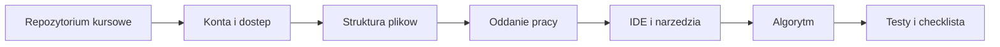

# 01. Organizacja pracy programisty

## Cel zajec

Po przejsciu tego skryptu student potrafi:

- odnalezc zadanie w repozytorium kursowym i opisac, gdzie zapisac rezultat pracy,
- przygotowac i wykorzystac konto GitHub oraz GitLab,
- pracowac na osobnej galezi i przekazac zmiane do sprawdzenia,
- zastosowac checkliste jakosci przed oddaniem zadania,
- dobrac proste IDE do zadania i uruchomic w nim kod,
- rozpoznac roznice miedzy bledem w kodzie, bledem konfiguracji i bledem procesu.

Material jest przeznaczony na laboratorium bez osobnego wykladu. Prowadzacy moze przeplatac
krotkie omowienie z wykonaniem kolejnych krokow przez studentow.

## Sciezka zajec

| Temat | Co student robi | Material |
| --- | --- | --- |
| 1. Repozytorium i konta | przygotowuje dostep i wykonuje pierwszy przeplyw pracy | [README tematu](01-repozytorium-i-konta/README.md) |
| 2. Struktura i oddawanie | porzadkuje pliki, opisuje prace i przechodzi checkliste | [README tematu](02-struktura-materialow-i-oddawanie/README.md) |
| 3. IDE i narzedzia | instaluje lub wybiera IDE, uruchamia kod, wlacza formatowanie i linting | [README tematu](03-ide-i-konfiguracja/README.md) |
| 4. Obliczenia i testy | implementuje algorytmy, dobiera przypadki testowe i analizuje pokrycie | [README tematu](04-obliczenia-i-testy/README.md) |

## Jak pracowac z materialem

1. Przeczytaj sekcje **Cel** i **Przygotowanie**.
2. Wykonaj sekcje oznaczone jako **Zadanie** bez zagladania do rozwiazania.
3. Uruchom kod lub sprawdz rezultat w repozytorium.
4. Otworz sekcje **Rozwiazanie i wyjasnienie**.
5. Na koniec przejdz checkliste i zapisz pytania do omowienia.

W kodzie uzywamy prostych nazw i konstrukcji. JavaScript jest tylko wspolnym nosnikiem
przykladow uruchamialnych lokalnie; najwazniejsze sa: przeplyw pracy, sposob myslenia,
warunki poprawnosci i umiejetnosc sprawdzenia wyniku.

## Mapa materialu

Zrodlo diagramu: [diagram mapy zajec](diagramy/mapa-sciezki.mmd).

## Wspolna checklista studenta

- [ ] Wiem, w jakim repozytorium znajduje sie zadanie.
- [ ] Pracuje na swojej galezi i potrafie wskazac ostatni commit.
- [ ] Kod lub dokumentacja maja jednoznaczna instrukcje uruchomienia.
- [ ] Sprawdzilem przypadek zwykly, brzegowy i niepoprawne dane, jesli maja sens.
- [ ] Nie dodalem hasel, tokenow, katalogow srodowiska ani plikow generowanych.
- [ ] README odpowiada na pytania: co zrobilem, jak uruchomic i jak sprawdzilem.
- [ ] Przed oddaniem przeczytalem tresc zadania jeszcze raz.
