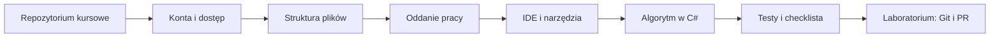

# 01. Organizacja pracy programisty

Na zajęciach korzystamy z C# i .NET. Ten moduł uzupełnia zajęcia z Podstaw programowania:
zakłada znajomość omawianych tam podstaw składni i koncentruje się na środowisku pracy,
organizacji projektu, kontroli zmian i jakości oddawanej pracy.

## Cel zajęć

Po przejściu tego skryptu student potrafi:

- odnaleźć zadanie w repozytorium kursowym i opisać, gdzie zapisać rezultat pracy,
- przygotować i wykorzystać konto GitHub oraz GitLab,
- pracować na osobnej gałęzi i przekazać zmianę do sprawdzenia,
- zastosować checklistę jakości przed oddaniem zadania,
- dobrać proste IDE do zadania i uruchomić w nim kod,
- rozpoznać różnice między błędem w kodzie, błędem konfiguracji i błędem procesu.

Materiał jest przeznaczony na laboratorium bez osobnego wykładu. Prowadzący może przeplatać
krótkie omówienie z wykonaniem kolejnych kroków przez studentów.

## Ścieżka zajęć

| Temat | Co student robi | Materiał |
| --- | --- | --- |
| 1. Repozytorium i konta | przygotowuje dostęp i wykonuje pierwszy przepływ pracy | [README tematu](01-repozytorium-i-konta/README.md) |
| 2. Struktura i oddawanie | porządkuje pliki, opisuje pracę i przechodzi checklistę | [README tematu](02-struktura-materialow-i-oddawanie/README.md) |
| 3. IDE i narzędzia | przygotowuje VS Code, Visual Studio lub Rider i uruchamia projekt C#/.NET | [README tematu](03-ide-i-konfiguracja/README.md) |
| 4. Obliczenia i testy | ćwiczy specyfikowanie i sprawdzanie prostych algorytmów w C# | [README tematu](04-obliczenia-i-testy/README.md) |
| 5. Laboratorium: środowisko i Git | samodzielnie przechodzi od nowego projektu do Pull Requestu i rozwiązania konfliktu | [README laboratorium](05-laboratorium-srodowisko-i-git/README.md) |

## Jak pracować z materiałem

1. Przeczytaj sekcje **Cel** i **Przygotowanie**.
2. Wykonaj sekcje oznaczone jako **Zadanie** bez zaglądania do rozwiązania.
3. Uruchom kod lub sprawdź rezultat w repozytorium.
4. Otwórz sekcję **Rozwiązanie i wyjaśnienie**.
5. Na koniec przejdź checklistę i zapisz pytania do omówienia.

Kod przykładów uruchamiamy za pomocą .NET CLI lub jednego z omawianych IDE. Najważniejsze
są: przepływ pracy, sposób myślenia, warunki poprawności i umiejętność sprawdzenia wyniku.

## Mapa materiału

```mermaid
flowchart LR
    A[Repozytorium kursowe] --> B[Konta i dostęp]
    B --> C[Struktura plików]
    C --> D[Oddanie pracy]
    D --> E[IDE i narzędzia]
    E --> F[Algorytm w C#]
    F --> G[Testy i checklista]
    G --> H[Laboratorium: Git i PR]
```

Źródło diagramu: [diagram mapy zajęć](diagramy/mapa-sciezki.mmd).

## Wspólna checklista studenta

- [ ] Wiem, w jakim repozytorium znajduje się zadanie.
- [ ] Pracuję na swojej gałęzi i potrafię wskazać ostatni commit.
- [ ] Kod lub dokumentacja mają jednoznaczną instrukcję uruchomienia.
- [ ] Sprawdziłem przypadek zwykły, brzegowy i niepoprawne dane, jeśli mają sens.
- [ ] Nie dodałem haseł, tokenów, katalogów środowiska ani plików generowanych.
- [ ] README odpowiada na pytania: co zrobiłem, jak uruchomić i jak sprawdziłem.
- [ ] Przed oddaniem przeczytałem treść zadania jeszcze raz.
