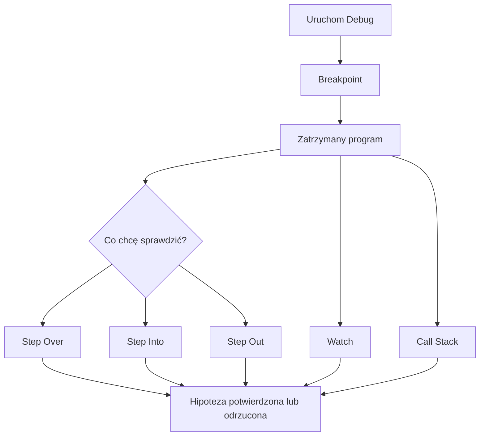

# 01. Podstawy debuggera

## Cel laboratorium

Po wykonaniu tematu student potrafi uruchomić aplikację konsolową w trybie debugowania,
zatrzymać ją w wybranym miejscu, obserwować wartości i prześledzić drogę wywołań metod.

Debugger nie naprawia kodu automatycznie. Pomaga zobaczyć, co program robi naprawdę.
Najpierw formułujemy pytanie, na przykład: „Dlaczego suma zmienia się na 22?”, a dopiero
potem wybieramy breakpoint, krokowanie albo Watch.

## Przygotowanie projektu

Kod przykładowy znajduje się w pliku [Program.cs](Program.cs), a projekt w
[DebugowaniePodstaw.csproj](DebugowaniePodstaw.csproj).

W terminalu otwartym w katalogu repozytorium wykonaj:

```text
dotnet run --project .\src\02-debug\01-podstawy-debuggera\DebugowaniePodstaw.csproj
```

Oczekiwany wynik:

```text
Scenariusz debuggera: podsumowanie wyników
Suma: 22
Maksimum: 9
Średnia: 5,50
```

Jeśli wynik się pojawia, aplikacja działa. Następne ćwiczenia wykonuj przez uruchomienie
jej w trybie **Debug**, a nie tylko przez `dotnet run`.

## Co to jest debugger?

Debugger to narzędzie, które pozwala zatrzymać wykonywanie programu i obejrzeć jego stan.
Stan programu obejmuje między innymi:

- bieżącą linię,
- wartości zmiennych i parametrów,
- aktywną metodę,
- wcześniejsze metody, które doprowadziły do bieżącego miejsca,
- wyrażenia obliczane podczas zatrzymania.

Debugger służy do sprawdzania hipotez. Jeżeli podejrzewasz, że `total` otrzymuje złą wartość
w pętli, zatrzymaj program przed instrukcją `total += value`, dodaj `total` i `value` do
Watch, a następnie wykonaj kilka kroków. Nie musisz od razu czytać całego programu.

## Otwieranie projektu w trzech IDE

### Visual Studio Code

1. Zainstaluj **C# Dev Kit** oraz rozszerzenie **C#** firmy Microsoft.
2. Wybierz **File -> Open Folder** i otwórz folder `01-podstawy-debuggera`.
3. Otwórz [DebugowaniePodstaw.csproj](DebugowaniePodstaw.csproj), jeśli IDE nie wykryje projektu automatycznie.
4. Otwórz [Program.cs](Program.cs).
5. Kliknij lewy margines przy wybranej linii, aby ustawić czerwony breakpoint.
6. Naciśnij `F5` albo wybierz **Run and Debug -> C#**.
7. Po zatrzymaniu używaj `F10` (Step Over), `F11` (Step Into) i `Shift+F11` (Step Out).
8. W panelu **Run and Debug** otwórz **Variables**, **Watch** i **Call Stack**.

### Visual Studio

1. Zainstaluj Visual Studio z workloadem **.NET desktop development**.
2. Otwórz plik [DebugowaniePodstaw.csproj](DebugowaniePodstaw.csproj) przez **Open a project or solution**.
3. Otwórz [Program.cs](Program.cs).
4. Ustaw breakpoint kliknięciem lewego marginesu albo klawiszem `F9`.
5. Naciśnij `F5` lub wybierz **Debug -> Start Debugging**.
6. Używaj `F10` (Step Over), `F11` (Step Into) i `Shift+F11` (Step Out).
7. Otwórz **Debug -> Windows -> Watch -> Watch 1** oraz **Debug -> Windows -> Call Stack**.

### Rider

1. Zainstaluj Rider i wskaż zainstalowany .NET SDK.
2. Otwórz folder `01-podstawy-debuggera` albo bezpośrednio [DebugowaniePodstaw.csproj](DebugowaniePodstaw.csproj).
3. Otwórz [Program.cs](Program.cs).
4. Ustaw breakpoint kliknięciem lewego marginesu albo `Ctrl+F8`.
5. Uruchom debugowanie przez `Shift+F9` lub przycisk z ikoną robaka.
6. Używaj `F8` (Step Over), `F7` (Step Into) i `Shift+F8` (Step Out).
7. W oknie **Debug** używaj **Variables**, **Watches** i **Call Stack**.

Nazwy menu mogą się różnić między wersjami. Jeżeli skrót nie działa, użyj menu IDE i
sprawdź opis polecenia obok jego nazwy.

## Pojęcia i ćwiczenia praktyczne

Poniższe przykłady odnoszą się do [Program.cs](Program.cs). Każdy wiersz oznaczony jako
miejsce zatrzymania można znaleźć po nazwie metody lub instrukcji, bez polegania na numerze linii.

### Breakpoint

Breakpoint mówi debuggerowi: „zatrzymaj program, zanim wykonasz tę instrukcję”. Po zatrzymaniu
możesz obejrzeć wartości i zdecydować, który krok wykonać dalej.

| Ćwiczenie | Visual Studio Code | Visual Studio | Rider |
| --- | --- | --- | --- |
| 1. Zatrzymaj program przy `total += value` w `CalculateTotal`. | Kliknij margines, `F5`, obserwuj `value` i `total`. | Kliknij margines lub `F9`, uruchom `F5`, otwórz Locals. | Kliknij margines lub `Ctrl+F8`, uruchom `Shift+F9`, otwórz Variables. |
| 2. Zatrzymuj tylko dla wartości większej niż `7`. | Prawy klik breakpointu -> **Edit Breakpoint** -> condition `value > 7`. | Prawy klik -> **Conditions** -> `value > 7`. | Prawy klik -> **More** -> condition `value > 7`. |
| 3. Zatrzymaj się na wejściu do `FindMaximum`. | Ustaw breakpoint na pierwszej instrukcji metody i uruchom `F5`. | Ustaw breakpoint na pierwszej instrukcji metody i uruchom `F5`. | Ustaw breakpoint na pierwszej instrukcji metody i uruchom `Shift+F9`. |

Breakpoint warunkowy jest przydatny, gdy pętla wykonuje się wiele razy, a problem dotyczy
jednej wartości. Zwykły breakpoint jest lepszy na początku nauki, bo pokazuje każdy krok.

### Step Over

**Step Over** wykonuje bieżącą instrukcję, ale nie wchodzi do metody wywoływanej w tej
instrukcji. Używaj go, gdy znasz działanie wywoływanej metody albo chcesz szybko przejść dalej.

| Ćwiczenie | Visual Studio Code | Visual Studio | Rider |
| --- | --- | --- | --- |
| 1. Wykonaj kolejne obroty pętli w `CalculateTotal`. | Zatrzymaj się na pętli i naciskaj `F10`; obserwuj zmianę `total`. | Naciskaj `F10`; wartości zobaczysz w Locals. | Naciskaj `F8`; wartości zobaczysz w Variables. |
| 2. Przejdź nad wywołaniem `CalculateTotal(values)`. | Ustaw breakpoint przed wywołaniem i naciśnij `F10`; metoda wykona się bez wejścia do środka. | Użyj `F10`; sprawdź, że wynik pojawi się w `total`. | Użyj `F8`; sprawdź wartość `total`. |
| 3. Przejdź nad instrukcją warunkową w `FindMaximum`. | Na breakpointcie użyj `F10` i porównaj `value` z `maximum`. | Użyj `F10` dla wartości `4`, `7`, `2`, `9`. | Użyj `F8` i obserwuj, kiedy zmienia się `maximum`. |

### Step Into

**Step Into** wchodzi do metody wywoływanej w bieżącej instrukcji. Używaj go, gdy podejrzewasz,
że błąd jest wewnątrz metody, a nie w miejscu jej wywołania.

| Ćwiczenie | Visual Studio Code | Visual Studio | Rider |
| --- | --- | --- | --- |
| 1. Wejdź z `RunScenario` do `CalculateTotal`. | Zatrzymaj się przed wywołaniem i naciśnij `F11`; sprawdź nazwę metody. | Naciśnij `F11`, a potem obejrzyj Call Stack. | Naciśnij `F7` i sprawdź aktywną metodę w Debug. |
| 2. Wejdź do `FindMaximum` i prześledź `if`. | Na wywołaniu `FindMaximum(values)` użyj `F11`; krok po kroku śledź pętlę. | Użyj `F11`, sprawdź wartości `value` i `maximum`. | Użyj `F7`, obserwuj, dla których danych wykona się ciało `if`. |
| 3. Wejdź do `CalculateAverage`. | Użyj `F11` na wywołaniu i sprawdź rzutowanie na `double`. | Użyj `F11` i obejrzyj wartość wyniku przed powrotem. | Użyj `F7`, a następnie odczytaj wartość zwracaną w Variables. |

### Step Out

**Step Out** kończy bieżącą metodę i wraca do miejsca, z którego została wywołana. Jest
przydatny, gdy wejście do metody okazało się niepotrzebne albo zakończyłeś jej analizę.

| Ćwiczenie | Visual Studio Code | Visual Studio | Rider |
| --- | --- | --- | --- |
| 1. Będąc w `CalculateTotal`, wróć do `RunScenario`. | Naciśnij `Shift+F11`; sprawdź przypisanie wyniku do `total`. | Naciśnij `Shift+F11`; sprawdź Locals w metodzie wywołującej. | Naciśnij `Shift+F8`; sprawdź miejsce powrotu. |
| 2. Będąc w `FindMaximum`, zakończ analizę pętli. | `Shift+F11` i obserwuj wartość `maximum` w `RunScenario`. | `Shift+F11` i sprawdź, że wykonanie jest po wywołaniu metody. | `Shift+F8` i sprawdź wynik w Variables. |
| 3. Będąc w `CalculateAverage`, wróć do wypisywania wyniku. | `Shift+F11`; następny krok pokaże instrukcję `Console.WriteLine`. | `Shift+F11`; obejrzyj wartość `average`. | `Shift+F8`; zobacz powrót do `RunScenario`. |

### Watch

**Watch** to lista zmiennych i wyrażeń obserwowanych podczas zatrzymania. Watch nie zmienia
programu. Pomaga porównywać wartości bez szukania ich za każdym razem w kodzie.

| Ćwiczenie | Visual Studio Code | Visual Studio | Rider |
| --- | --- | --- | --- |
| 1. Obserwuj `total`, `value` i `maximum`. | W panelu Watch wybierz **Add to Watch** albo wpisz nazwy ręcznie. | W **Watch 1** wpisz trzy nazwy. | W **Watches** wpisz trzy nazwy. |
| 2. Obserwuj wyrażenie `values.Length`. | Dodaj wyrażenie w Watch i przechodź `F10`. | Dodaj `values.Length` w Watch 1. | Dodaj `values.Length` w Watches. |
| 3. Obserwuj warunek `value > maximum`. | Dodaj warunek i sprawdź, kiedy zmienia się na `true`. | Dodaj wyrażenie w Watch 1 i przechodź pętlę. | Dodaj wyrażenie w Watches i sprawdź kolejne iteracje. |

Jeżeli wyrażenie nie jest dostępne w aktualnym zakresie, debugger pokaże błąd albo znak zapytania.
To także jest informacja: zmienna może istnieć w innej metodzie, ale nie w bieżącej klatce.

### Call stack

**Call stack** (stos wywołań) pokazuje, jak program dotarł do aktualnej metody. Czytaj go od
najbardziej wewnętrznej klatki do miejsca rozpoczęcia scenariusza. W tym przykładzie zobaczysz
łańcuch podobny do `RunScenario -> CalculateTotal` albo `RunScenario -> FindMaximum`.

| Ćwiczenie | Visual Studio Code | Visual Studio | Rider |
| --- | --- | --- | --- |
| 1. Odczytaj drogę do `CalculateTotal`. | Otwórz **Call Stack** i kliknij klatkę `RunScenario`. | Otwórz **Debug -> Windows -> Call Stack** i wybierz `RunScenario`. | Otwórz **Call Stack** i wybierz metodę wywołującą. |
| 2. Zmień aktywną klatkę i zobacz jej zmienne. | Kliknij `CalculateTotal`, potem `RunScenario`; porównaj dostępne wartości. | Kliknij klatki w Call Stack i obserwuj Locals. | Kliknij klatki i obserwuj Variables dla wybranego zakresu. |
| 3. Ustal, czy problem jest w wywołaniu, czy w metodzie. | Zatrzymaj się w `FindMaximum` i przejdź do klatki wywołującej. | Porównaj argument `values` w obu klatkach. | Użyj Call Stack i sprawdź miejsce powrotu po Step Out. |

## Zadania do samodzielnego wykonania

W każdym zadaniu najpierw uruchom program w debuggerze. Nie zmieniaj testu ani oczekiwanego
wyniku tylko po to, aby ukryć problem.

### Zadanie 1: maksimum liczb ujemnych

W poniższej wersji funkcji znajdź błąd za pomocą breakpointu i Watch:

```csharp
static int FindMaximum(int[] values)
{
    int maximum = 0;
    foreach (int value in values)
    {
        if (value > maximum)
        {
            maximum = value;
        }
    }

    return maximum;
}
```

Sprawdź dane `[-4, -7, -2]`. Program zwraca `0`, choć największą wartością jest `-2`.

#### Rozwiązanie zadania 1 i wyjaśnienie

```csharp
static int FindMaximum(int[] values)
{
    int maximum = values[0];
    foreach (int value in values)
    {
        if (value > maximum)
        {
            maximum = value;
        }
    }

    return maximum;
}
```

Breakpoint w pętli pokazuje, że `maximum` zaczyna od `0`, czyli od wartości spoza danych.
Inicjalizacja pierwszym elementem zapewnia, że wynik będzie należał do tablicy. Warto dodatkowo
omówić pustą tablicę: implementacja wymaga wtedy osobnej walidacji albo jawnego warunku wstępnego.

### Zadanie 2: średnia jako dzielenie całkowite

Zdebuguj funkcję:

```csharp
static double CalculateAverage(int total, int count)
{
    return total / count;
}
```

Dla `total = 5` i `count = 2` program zwraca `2`, a oczekiwany wynik to `2.5`. Użyj Step
Into i Watch, aby sprawdzić typy argumentów oraz moment utraty części ułamkowej.

#### Rozwiązanie zadania 2 i wyjaśnienie

```csharp
static double CalculateAverage(int total, int count)
{
    return (double)total / count;
}
```

Oba argumenty są typu `int`, więc przed rzutowaniem wynik dzielenia jest całkowity. Rzutowanie
jednego argumentu na `double` zmienia rodzaj operacji. Należy też dopisać warunek `count != 0`,
jeśli funkcja ma przyjmować dane z zewnątrz.

### Zadanie 3: granica pętli

Znajdź błąd w kodzie:

```csharp
static int CalculateTotal(int[] values)
{
    int total = 0;
    for (int index = 0; index <= values.Length; index++)
    {
        total += values[index];
    }

    return total;
}
```

Uruchom debugger i zobacz, na której wartości `index` pojawia się wyjątek. Następnie popraw
warunek i sprawdź tablicę z jednym oraz z czterema elementami.

#### Rozwiązanie zadania 3 i wyjaśnienie

```csharp
for (int index = 0; index < values.Length; index++)
{
    total += values[index];
}
```

Ostatni poprawny indeks to `values.Length - 1`. Warunek `<=` pozwala na próbę odczytu indeksu
równego długości tablicy, który nie istnieje. Breakpoint przed `values[index]` i Watch dla
`index` pokazują moment tuż przed wyjątkiem.

### Zadanie 4: niewłaściwy krok debugowania

Ustaw breakpoint przed każdym wywołaniem w `RunScenario` i odpowiedz:

1. Kiedy użyć Step Over zamiast Step Into?
2. Do której metody wejść, aby sprawdzić obliczanie maksimum?
3. W której klatce Call Stack znajdziesz `values`?

Następnie odtwórz przebieg programu, używając tylko trzech breakpointów i zapisując wartości
`total`, `maximum` i `average`.

#### Rozwiązanie zadania 4 i wyjaśnienie

1. Step Over stosujemy przy metodzie, której działania nie analizujemy, na przykład po
   sprawdzeniu `CalculateTotal`.
2. Do `FindMaximum`, jeśli sprawdzamy, dlaczego wynik maksimum jest błędny.
3. `values` jest parametrem `RunScenario`, a także parametrem metod, które go otrzymują.
   Dostępność zależy od wybranej klatki stosu.

Przykładowe obserwacje dla poprawnego programu:

```text
po CalculateTotal: total = 22
po FindMaximum: maximum = 9
po CalculateAverage: average = 5.5
```

## Co zapisać po laboratorium

- nazwę użytego IDE,
- skróty lub polecenia dla breakpointu, Step Over, Step Into i Step Out,
- przykład wyrażenia dodanego do Watch,
- przykładowy Call Stack,
- jedną hipotezę, którą potwierdził debugger,
- opis poprawki z jedną przyczyną i jednym skutkiem.

## Diagram



Źródło diagramu: [cykl debugowania](diagramy/cykl-debugowania.mmd).
