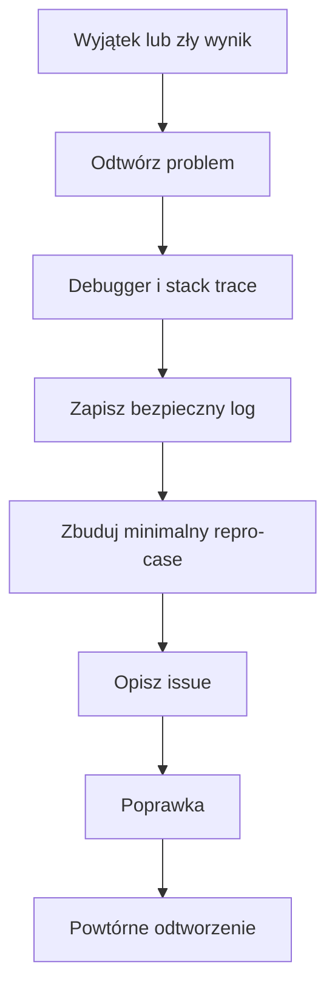
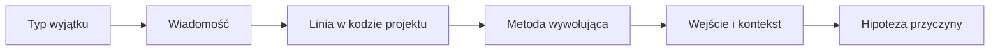

# 02. Debugowanie błędów wykonania

## Cel laboratorium

Błąd wykonania pojawia się wtedy, gdy program nie może kontynuować działania zgodnie z
instrukcjami. Może to być wyjątek, niepoprawne dane, brak pliku albo błąd komunikacji.
Nie każdy problem kończy program. Czasem program działa, ale zapisuje niewiarygodny wynik.

Po wykonaniu tematu student potrafi:

- rozpoznać wyjątek i odczytać jego typ oraz komunikat,
- użyć logu do zapisania kontekstu problemu,
- odróżnić asercję od walidacji danych użytkownika,
- zbudować minimalny repro-case,
- czytać stack trace od miejsca awarii do miejsca wywołania,
- przygotować rzeczowe issue na GitHubie lub GitLabie.

## Przygotowanie projektu

Kod przykładowy znajduje się w [Program.cs](Program.cs), a projekt w
[BledyWykonania.csproj](BledyWykonania.csproj).

Uruchomienie z katalogu repozytorium:

```text
dotnet run --project .\src\02-debug\02-bledy-wykonania\BledyWykonania.csproj
```

Oczekiwany wynik:

```text
Scenariusz błędów wykonania
Średnia ocen: 4,00
Temat: debugger; znalezionych problemów: 3
```

Aby zobaczyć obsługę wyjątku, w [Program.cs](Program.cs) zmień tymczasowo dane:

```csharp
string[] scores = ["4", "x", "3"];
```

Po uruchomieniu zobaczysz komunikat `[ERROR]` i stack trace `FormatException`. Po ćwiczeniu
przywróć poprawne dane albo obsłuż wejście tak, aby użytkownik dostał jasny komunikat.

## Wyjątek

Wyjątek to obiekt opisujący sytuację, w której wykonanie bieżącej operacji nie może być
kontynuowane. W C# wyjątek może zostać rzucony przez kod (`throw`) i przechwycony przez
`try/catch`.

```csharp
static double Divide(int numerator, int denominator)
{
    if (denominator == 0)
    {
        throw new ArgumentException("Mianownik nie może być zerem", nameof(denominator));
    }

    return (double)numerator / denominator;
}
```

Dobra obsługa wyjątku:

- sprawdza dane możliwie blisko granicy systemu,
- zawiera komunikat mówiący, co było niepoprawne,
- nie ukrywa problemu pustym `catch`,
- zachowuje kontekst potrzebny do odtworzenia problemu,
- nie pokazuje użytkownikowi sekretów ani całego logu z danymi prywatnymi.

Nie przechwytuj wszystkich wyjątków tylko po to, aby program „nie pokazywał błędu”. Najpierw
zdecyduj, czy błąd można obsłużyć lokalnie, czy trzeba przerwać operację i przekazać problem wyżej.

## Logi i logowanie

Log jest zapisem zdarzenia w czasie działania programu. Minimalny log powinien odpowiadać
na pytania:

- kiedy wystąpił problem,
- jakiego fragmentu programu dotyczył,
- jakie były bezpieczne dane wejściowe,
- jaki był typ i komunikat błędu,
- jaki krok może wykonać osoba obsługująca problem.

W przykładzie [Program.cs](Program.cs) funkcja `LogError` zapisuje znacznik czasu, komunikat
i wyjątek do `Console.Error`:

```csharp
static void LogError(string message, Exception exception)
{
    Console.Error.WriteLine($"[ERROR] {DateTime.UtcNow:O} {message}");
    Console.Error.WriteLine(exception.ToString());
}
```

Na zajęciach wystarcza `Console.Error`. W większej aplikacji można użyć `ILogger` i poziomów
`Trace`, `Debug`, `Information`, `Warning` oraz `Error`. Log nie powinien zawierać haseł,
tokenów, pełnych danych osobowych ani innych sekretów.

## Asercje

Asercja wyraża założenie programisty o stanie programu. W C# `Debug.Assert` jest szczególnie
przydatne podczas pracy w trybie Debug:

```csharp
string report = BuildReport("debugger", 3);
Debug.Assert(report.Length > 0, "Raport nie może być pusty");
```

Asercja nie jest zamiennikiem walidacji danych użytkownika. Jeśli użytkownik może podać pusty
temat, użyj walidacji i `ArgumentException`. Asercję stosuj do sytuacji, która według kontraktu
wewnętrznego programu nie powinna wystąpić.

Przykłady założeń:

1. po zbudowaniu raport ma co najmniej jeden znak,
2. licznik elementów nie może być ujemny,
3. po wyjściu z pętli indeks jest w ustalonym zakresie.

## Minimalny repro-case

Minimalny repro-case to najmniejszy zestaw kodu, danych i kroków, który nadal odtwarza problem.
Nie wysyłaj całego projektu, jeśli problem można pokazać w jednej funkcji.

### Jak go przygotować

1. Zapisz dokładne wejście powodujące problem.
2. Usuń kod, który nie jest potrzebny do odtworzenia.
3. Zostaw instrukcję uruchomienia od czystego katalogu.
4. Zapisz wynik aktualny i oczekiwany.
5. Dodaj wersję .NET, system i sposób uruchomienia.
6. Upewnij się, że przykład nie zawiera sekretów.

Przykład małego repro-case:

```csharp
string[] values = ["4", "x", "3"];
int total = 0;
foreach (string value in values)
{
    total += int.Parse(value);
}
```

To wystarcza, aby odtworzyć `FormatException`. Nie trzeba dołączać całej aplikacji studenckiej.

## Czytanie stack trace

Stack trace czytaj od miejsca, w którym wyjątek powstał, do metody, która rozpoczęła operację.
Przykładowy skrócony zapis:

```text
System.FormatException: The input string 'x' was not in a correct format.
   at System.Int32.Parse(String s)
   at Program.<<Main>$>g__CalculateAverage|0_0(String[] values) in Program.cs:line 31
   at Program.<<Main>$>g__RunScenario|0_0() in Program.cs:line 8
```

Jak czytać:

1. `FormatException` mówi, jakiego rodzaju problem wystąpił.
2. Wiadomość wskazuje wartość `x`, która nie pasuje do liczby całkowitej.
3. Pierwsza klatka z kodem projektu wskazuje metodę i linię podejrzaną o błąd.
4. Kolejna klatka pokazuje, kto wywołał tę metodę.
5. Należy sprawdzić dane wejściowe i kontrakt `CalculateAverage`, a nie poprawiać pliku systemowego .NET.

Numery linii zależą od wersji pliku. Nazwy metod i fragment komunikatu są ważniejsze niż
przepisanie całego stack trace bez zrozumienia.

## Kultura zgłaszania błędów

Issue jest prośbą o rozwiązanie konkretnego problemu. Dobre zgłoszenie pozwala innej osobie
odtworzyć problem bez rozmowy na żywo.

### Szablon issue

```markdown
## Tytuł
Krótki opis objawu i miejsca, np. Średnia ocen kończy się FormatException dla pustej wartości

## Środowisko
- system: Windows 11
- .NET SDK: 9.0.318
- commit: abc1234
- sposób uruchomienia: dotnet run --project ...

## Kroki odtworzenia
1. Uruchom ...
2. Wprowadź ...
3. Wybierz ...

## Wynik aktualny
Wklej krótki komunikat błędu i istotny fragment stack trace.

## Wynik oczekiwany
Opisz, co program powinien zrobić.

## Minimalny repro-case
Link do własnego repozytorium albo krótki fragment kodu bez sekretów.

## Dodatkowe informacje
Co już sprawdzono i jaki jest wpływ problemu?
```

Na GitHubie wybierz zakładkę **Issues -> New issue**, a na GitLabie **Plan -> Issues -> New issue**.
Wklej szablon, nadaj opisowy tytuł i sprawdź, czy repozytorium oraz logi nie zawierają danych
wrażliwych. Do oddania pracy używasz własnego repozytorium studenta; issue może być prywatne,
jeśli repozytorium jest prywatne i prowadzący ma dostęp.

Unikaj tytułów „Nie działa”, „Pomocy” i „Błąd w kodzie”. Nie obwiniaj osoby. Opisz zachowanie,
warunki i wpływ problemu.

## Zadania do samodzielnego wykonania

### Zadanie 1: dzielenie przez zero

Zdebuguj funkcję:

```csharp
static double Divide(int numerator, int denominator)
{
    return numerator / denominator;
}
```

Uruchom ją dla `10` i `0`. Zobacz typ wyjątku, komunikat i stack trace. Następnie popraw
funkcję tak, aby odrzucała niepoprawny mianownik z jasnym komunikatem.

#### Rozwiązanie zadania 1 i wyjaśnienie

```csharp
static double Divide(int numerator, int denominator)
{
    if (denominator == 0)
    {
        throw new ArgumentException("Mianownik nie może być zerem", nameof(denominator));
    }

    return (double)numerator / denominator;
}
```

Sprawdzenie:

```csharp
Console.WriteLine(Divide(10, 2));
try
{
    Console.WriteLine(Divide(10, 0));
}
catch (ArgumentException exception)
{
    Console.Error.WriteLine(exception.Message);
}
```

Rzutowanie na `double` jest potrzebne, aby dla `5 / 2` otrzymać `2.5`, a walidacja usuwa
przyczynę wyjątku zamiast ukrywać go pustym `catch`.

### Zadanie 2: bezpieczne odczytywanie liczb

Zdebuguj kod:

```csharp
static int ReadNumber(string text)
{
    return int.Parse(text);
}
```

Dla tekstu `"abc"` program kończy się `FormatException`. Wybierz zachowanie: funkcja ma
zwrócić `true` i liczbę przez parametr `out`, albo ma zgłosić błąd domenowy z własnym komunikatem.

#### Rozwiązanie zadania 2 i wyjaśnienie

Wersja z `TryParse` nie używa wyjątku do zwykłej kontroli danych:

```csharp
static bool TryReadNumber(string text, out int number)
{
    return int.TryParse(text, out number);
}
```

Przykład użycia:

```csharp
if (TryReadNumber("abc", out int number))
{
    Console.WriteLine(number);
}
else
{
    Console.WriteLine("Podaj liczbę całkowitą.");
}
```

Wyjątek jest właściwy dla sytuacji wyjątkowej, a `TryParse` dla spodziewanego odrzucenia
wpisanego tekstu. W obu przypadkach komunikat dla użytkownika powinien być zrozumiały.

### Zadanie 3: pusty zbiór i asercja

Funkcja zwraca `NaN`, gdy lista jest pusta:

```csharp
static double Average(int[] values)
{
    int total = values.Sum();
    return (double)total / values.Length;
}
```

Ustal warunek wstępny, dodaj walidację i dodaj asercję, która dokumentuje założenie po walidacji.

#### Rozwiązanie zadania 3 i wyjaśnienie

```csharp
static double Average(int[] values)
{
    if (values.Length == 0)
    {
        throw new ArgumentException("Lista nie może być pusta", nameof(values));
    }

    Debug.Assert(values.Length > 0, "Po walidacji lista powinna zawierać elementy");
    return (double)values.Sum() / values.Length;
}
```

Walidacja obsługuje dane, które mogą pochodzić od użytkownika. Asercja dokumentuje założenie
wewnątrz metody. Gdyby ktoś później zmienił kolejność kodu i usunął walidację, asercja może
pomóc wykryć złamanie kontraktu podczas debugowania.

### Zadanie 4: repro-case i issue

Otrzymujesz zgłoszenie: „Średnia ocen czasem nie działa”. Przygotuj lepsze issue:

1. zapisz dane wejściowe,
2. odtwórz problem w osobnym, małym fragmencie,
3. dołącz istotny stack trace,
4. podaj wynik aktualny i oczekiwany,
5. dopisz wersję .NET i commit,
6. usuń z przykładu dane osobowe i sekrety.

#### Rozwiązanie zadania 4 i wyjaśnienie

Przykładowe zgłoszenie:

```markdown
## Tytuł
CalculateAverage zgłasza FormatException dla wartości x

## Środowisko
- Windows 11
- .NET SDK 9.0.318
- commit: 4e12abc

## Kroki odtworzenia
1. Ustaw values na ["4", "x", "3"].
2. Uruchom BledyWykonania.csproj przez dotnet run.

## Wynik aktualny
FormatException w int.Parse podczas CalculateAverage.

## Wynik oczekiwany
Niepoprawna ocena powinna zostać odrzucona z jasnym komunikatem, bez stack trace dla użytkownika.

## Repro-case
Minimalny fragment z funkcją CalculateAverage i tablicą ["4", "x", "3"].
```

Takie zgłoszenie pozwala odtworzyć problem, wskazuje jego wpływ i nie wymaga zgadywania,
co oznacza „czasem”.

## Checklista przed zamknięciem zadania

- [ ] Uruchomiłem poprawny scenariusz i scenariusz błędny.
- [ ] Rozróżniam wyjątek, log i asercję.
- [ ] Stack trace wskazuje mi typ wyjątku i miejsce w kodzie projektu.
- [ ] Log zawiera czas, kontekst i wyjątek, ale nie zawiera sekretu.
- [ ] Repro-case jest mniejszy niż cały projekt.
- [ ] Issue zawiera kroki, wynik aktualny, wynik oczekiwany i środowisko.

## Diagramy



Źródło diagramu: [obsługa błędu](diagramy/obsluga-bledu.mmd).



Źródło diagramu: [czytanie stack trace](diagramy/czytanie-stack-trace.mmd).
