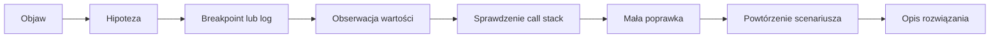

# 02. Debugowanie kodu i błędów wykonania

## Cel działu

Celem laboratoriów jest nauczenie się metodycznego szukania przyczyny problemu w programie.
Student nie ma tylko „znaleźć linijki z błędem”. Ma umieć postawić hipotezę, zebrać obserwacje,
sprawdzić ją w debuggerze i opisać poprawkę.

Po wykonaniu działu student potrafi:

- uruchomić aplikację konsolową w trybie debugowania,
- zatrzymać program w wybranym miejscu i obserwować wartości,
- przechodzić przez kod krok po kroku oraz czytać call stack,
- odróżnić błąd logiczny od wyjątku i błędu konfiguracji,
- użyć logu, asercji i minimalnego repro-case,
- przeczytać stack trace i przygotować dobre zgłoszenie issue.

## Wymagania

- .NET SDK 8 lub nowszy,
- jedno z IDE: Visual Studio Code, Visual Studio albo Rider,
- lokalna kopia repozytorium kursowego,
- terminal i możliwość wykonywania poleceń `dotnet`.

Przykłady są w C#, ponieważ ten sam projekt konsolowy można otworzyć w każdym z trzech
wymienionych IDE. Nie trzeba znać zaawansowanej składni. Najważniejsze są obserwacje:
aktualna wartość zmiennej, miejsce wykonania programu i droga wywołań metod.

## Mapa działu

| Temat | Praktyka | Materiał |
| --- | --- | --- |
| 1. Podstawy debuggera | zatrzymywanie i śledzenie programu | [README tematu](01-podstawy-debuggera/README.md) |
| 2. Błędy wykonania | wyjątki, logi, asercje i zgłoszenia | [README tematu](02-bledy-wykonania/README.md) |

## Zalecany sposób pracy

1. Uruchom działający przykład, aby znać jego normalny rezultat.
2. Przeczytaj zadanie i zapisz hipotezę, zanim zmienisz kod.
3. Użyj jednego narzędzia diagnostycznego naraz.
4. Zapisz obserwację: wejście, aktualne wartości, miejsce w kodzie i wynik.
5. Wprowadź najmniejszą poprawkę.
6. Uruchom program ponownie i sprawdź przypadki, których dotyczyła zmiana.

Źródło diagramu: [mapa debugowania](diagramy/mapa-debugowania.mmd).

## Wspólna checklista

- [ ] Potrafię odtworzyć problem.
- [ ] Wiem, jakie wejście uruchamia problem.
- [ ] Mam hipotezę, a nie tylko podejrzenie wskazanej linijki.
- [ ] Sprawdziłem wartości przed i po podejrzanym kroku.
- [ ] Po poprawce uruchomiłem przypadek, który wcześniej się psuł.
- [ ] Sprawdziłem co najmniej jeden zwykły i jeden brzegowy przypadek.
- [ ] Opisałem, dlaczego poprawka usuwa przyczynę problemu.
