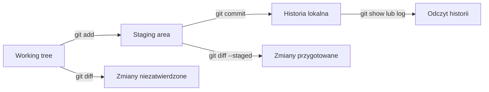

# 01. Podstawy Gita

## Cel laboratorium

Po wykonaniu tematu student potrafi utworzyć lokalne repozytorium, zapisać logiczną zmianę
i odczytać, co zmieniło się między kolejnymi commitami. Zna również rolę `.gitignore`
i potrafi napisać komunikat, który pomaga zrozumieć historię projektu.

## Model pracy

Git przechowuje historię snapshotów projektu. W uproszczeniu pracujemy w trzech miejscach:

1. **Working tree** - pliki, które widzisz i edytujesz.
2. **Staging area** - zmiany wybrane do najbliższego commitu.
3. **Repository** - lokalna historia commitów.

Commit nie jest automatycznym zapisem każdego znaku. Jest opisanym punktem historii, który
powinien przedstawiać jedną logiczną zmianę.



Źródło diagramu: [trzy obszary pracy Gita](diagramy/obszary-pracy.mmd).

## Przygotowanie

Sprawdź instalację:

```text
git --version
```

Ustaw autora commitów, jeśli Git nie zna jeszcze Twojej tożsamości:

```text
git config --global user.name "Imię Nazwisko"
git config --global user.email "adres@example.com"
```

Nie używaj cudzego adresu ani danych, których nie chcesz mieć w historii repozytorium.

## Komendy krok po kroku

### `git init`

Tworzy nowe repozytorium w bieżącym katalogu:

```text
mkdir warsztat-git-cwiczenie
cd warsztat-git-cwiczenie
git init
```

W katalogu pojawia się ukryty folder `.git`. Nie edytuj jego zawartości ręcznie.

### `git clone`

Kopiuje istniejące repozytorium wraz z historią. Używaj go, gdy repozytorium już istnieje
na GitHubie lub GitLabie:

```text
git clone ADRES_REPOZYTORIUM
cd NAZWA_REPOZYTORIUM
```

Nie wykonuj `git init` wewnątrz świeżo sklonowanego repozytorium.

### `git status`

Pokazuje aktualny stan working tree i staging area:

```text
git status
```

Uruchamiaj tę komendę często. Odpowiada na pytanie: „Co Git widzi i co stanie się przy
następnym commicie?”.

### `git add`

Przenosi wybraną zmianę do staging area:

```text
git add README.md
git add notatki.txt
```

`git add .` jest wygodne, ale na początku lepiej dodawać pliki świadomie. Dzięki temu
łatwiej nie dołączyć logów, sekretów albo zmian niezwiązanych z zadaniem.

### `git commit`

Zapisuje staging area jako punkt historii:

```text
git commit -m "Dodaj notatkę o statusie repozytorium"
```

Commit zapisuje tylko to, co było w staging area. Zmiana pozostawiona poza staging area
nie trafi do tego commitu.

### `git log`

Pokazuje historię:

```text
git log
git log --oneline --decorate --graph
```

Wersja skrócona jest przydatna do szybkiego sprawdzenia kolejności commitów.

### `git diff`

Pokazuje różnice:

```text
git diff
```

To zmiany w working tree, które nie są jeszcze w staging area. Po `git add` użyj:

```text
git diff --staged
```

To najważniejsza kontrola przed commitem: sprawdzasz dokładnie to, co zamierzasz zapisać.

## Przykład od początku do końca

W świeżym katalogu utwórz w edytorze plik `README.md`:

```markdown
# Moje ćwiczenie Git

Uczę się sprawdzać historię zmian.
```

Następnie wykonaj:

```text
git init
git status
git add README.md
git diff --staged
git commit -m "Dodaj README ćwiczenia"
git log --oneline
git status
```

Po commicie `git status` powinien informować, że working tree jest czysty. Jeśli dopiszesz
jedną linię do README, `git diff` pokaże tę linię, ale historia pozostanie bez zmian do czasu
kolejnego `add` i `commit`.

## Ignorowanie plików przez `.gitignore`

`.gitignore` zawiera wzorce plików, których Git nie powinien proponować do śledzenia. Przykład:

```gitignore
# Pliki systemowe i IDE
.DS_Store
.idea/
.vscode/

# Artefakty budowania
bin/
obj/
dist/

# Dane lokalne i sekrety
.env
*.local
```

`.gitignore` nie usuwa pliku, który został już zapisany w historii. Jeśli sekret był już
śledzony, samo dopisanie go do `.gitignore` nie wystarczy: trzeba usunąć go ze śledzenia,
zabezpieczyć ujawniony klucz i ustalić z prowadzącym dalsze kroki.

Przykład sprawdzenia:

```text
git status
git check-ignore -v .env
```

Nie ignoruj plików potrzebnych do odtworzenia projektu, na przykład plików konfiguracyjnych,
które nie zawierają sekretów.

## Dobre komunikaty commitów

Dobry komunikat odpowiada na pytanie: „Co zmienił ten commit?”. Powinien:

- zaczynać się czasownikiem w trybie rozkazującym, np. `Dodaj`, `Popraw`, `Usuń`, `Zmień`,
- opisywać jedną logiczną zmianę,
- być krótki w pierwszej linii,
- nie zawierać numeru zadania jako jedynej treści,
- nie ukrywać wielu niezależnych zmian pod `różne poprawki`.

| Słaby komunikat | Lepszy komunikat |
| --- | --- |
| `zmiany` | `Dodaj instrukcję uruchomienia` |
| `fix` | `Popraw walidację pustej nazwy` |
| `zadanie 1` | `Dodaj ćwiczenie z git diff` |
| `różne` | dwa osobne commity: opisujące konkretne zmiany |

## Zadania do samodzielnego wykonania

### Zadanie 1: historia jednej zmiany

1. Utwórz katalog `git-01` i zainicjalizuj repozytorium.
2. Dodaj `README.md` z tytułem i jednym zdaniem.
3. Sprawdź `git status`.
4. Dodaj plik do staging area i sprawdź `git diff --staged`.
5. Utwórz commit `Dodaj README ćwiczenia`.
6. Dopisz drugie zdanie, ale przed commitem pokaż `git diff`.
7. Utwórz drugi commit i wyświetl `git log --oneline`.

#### Rozwiązanie zadania 1

Oczekiwany model historii:

```text
abc1234 Dodaj drugie zdanie do README
789abcd Dodaj README ćwiczenia
```

Jeśli pierwsze `git status` pokazało plik jako `Untracked`, nie był jeszcze śledzony.
Po `git add` powinien pojawić się jako zmiana przygotowana do commitu. Po drugim commicie
`git log` powinien pokazać dwa osobne punkty historii.

### Zadanie 2: staging i diff

W pliku `README.md` wykonaj dwie niezależne zmiany: dopisz opis uruchomienia i dopisz pytanie
kontrolne. Dodaj do staging tylko opis uruchomienia. Pokaż:

```text
git diff
git diff --staged
git status
```

#### Rozwiązanie zadania 2

`git diff` powinien pokazywać pytanie kontrolne, a `git diff --staged` opis uruchomienia.
Następnie utwórz commit tylko z opisem uruchomienia. Drugą zmianę dodaj w kolejnym commicie.
To ćwiczenie pokazuje, że staging area pozwala podzielić pracę na logiczne commity.

### Zadanie 3: `.gitignore`

1. Utwórz `.env`, `.vscode/settings.json` i `notatki.txt`.
2. Dodaj `.env` i `.vscode/` do `.gitignore`.
3. Sprawdź `git status` oraz `git check-ignore -v .env`.
4. Dodaj i zatwierdź tylko `.gitignore` oraz `notatki.txt`.

#### Rozwiązanie zadania 3

Przykładowy `.gitignore`:

```gitignore
.env
.vscode/
```

W `git status` powinien być widoczny `notatki.txt`, ale nie `.env` ani `settings.json`.
Jeśli `.env` był wcześniej zatwierdzony, wykonaj po upewnieniu się, że nie ma w nim sekretu:

```text
git rm --cached .env
```

Następnie utwórz commit usuwający plik ze śledzenia i zmień ewentualny ujawniony klucz.

### Zadanie 4: dobre komunikaty

Przepisz poniższe komunikaty tak, aby każdy opisywał jedną logiczną zmianę:

```text
update
poprawki
final
zadanie 2
```

#### Rozwiązanie zadania 4

Możliwe odpowiedzi:

```text
Dodaj przykład użycia git log
Popraw literówkę w instrukcji clone
Usuń plik tymczasowy z repozytorium
Dodaj checklistę do zadania z diff
```

Nie istnieje jedna obowiązkowa treść, ale komunikat powinien pozwolić zrozumieć zmianę bez
otwierania wszystkich plików.

## Checklista

- [ ] Potrafię wyjaśnić różnicę między working tree, staging area i historią.
- [ ] Użyłem `status`, `diff` i `diff --staged` przed commitem.
- [ ] Historia ma małe, logiczne commity.
- [ ] `.gitignore` nie ukrywa plików potrzebnych do odtworzenia projektu.
- [ ] W repozytorium nie ma sekretów.
