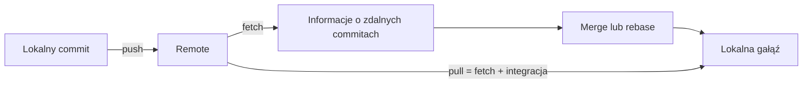

# 02. Repozytorium zdalne i praca w parach

## Cel laboratorium

Po wykonaniu tematu student potrafi połączyć lokalne repozytorium z GitHubem lub GitLabem,
pobrać i wysłać zmiany oraz rozwiązać typowe problemy synchronizacji. Potrafi też wykonać
pierwsze code review w parze, skupiając komentarz na kodzie i kryteriach zadania.

## Repozytorium lokalne i zdalne

- **Lokalne repozytorium** znajduje się na komputerze studenta i zawiera pełną historię.
- **Repozytorium zdalne** znajduje się na GitHubie lub GitLabie i jest wspólnym punktem
  synchronizacji.
- **Remote** to nazwana ścieżka do repozytorium zdalnego. Najczęściej używa się nazwy `origin`.
- **Upstream** oznacza gałąź zdalną, z którą powiązana jest lokalna gałąź, na przykład
  `origin/main`.

Remote nie jest magiczną kopią ekranu. `push` wysyła commity, a `fetch` pobiera informacje
o nowych commitach. Dopiero `merge`, `rebase` albo `pull` z odpowiednią strategią zmienia
lokalną gałąź.



Źródło diagramu: [przepływ zdalny](diagramy/przeplyw-zdalny.mmd).

## Przygotowanie własnego repozytorium

Każdy student pracuje we własnym repozytorium GitHub lub GitLab, zgodnie z zasadami
z [materiału o strukturze i oddawaniu prac](../../01-organizacja/02-struktura-materialow-i-oddawanie/README.md).
Nie wysyłamy commitów do repozytorium kursowego.

### Wariant A: repozytorium zdalne istnieje

```text
git clone ADRES_REPOZYTORIUM
cd NAZWA_REPOZYTORIUM
git remote -v
git status
```

### Wariant B: istnieje tylko lokalne repozytorium

Utwórz puste repozytorium na GitHubie lub GitLabie, bez dodatkowego README, jeśli lokalne
repozytorium ma już własny README. Następnie wykonaj:

```text
git remote add origin ADRES_REPOZYTORIUM
git remote -v
git push -u origin main
```

Jeśli główna gałąź nazywa się `master`, użyj tej nazwy albo zmień ją świadomie:

```text
git branch -M main
```

## Podstawowe komendy pracy z remote

### `git remote`

```text
git remote -v
git remote show origin
git remote set-url origin NOWY_ADRES
```

Pierwsza komenda pokazuje adresy pobierania i wysyłania. Przed `push` sprawdź, czy adres
prowadzi do Twojego repozytorium, a nie do obcego projektu.

### `git fetch`

```text
git fetch origin
git log --oneline --decorate --graph --all
```

`fetch` pobiera nowe obiekty i aktualizuje informacje o gałęziach zdalnych, ale nie zmienia
Twojej bieżącej gałęzi. Dzięki temu możesz najpierw obejrzeć różnicę:

```text
git diff main origin/main
```

### `git pull`

```text
git pull --rebase origin main
```

`pull` pobiera zmiany i integruje je z bieżącą gałęzią. Opcja `--rebase` utrzymuje prostą
historię, ale nie używaj jej bez zrozumienia, gdy gałąź jest już wspólna dla innych osób.

### `git push`

```text
git push -u origin main
git push
```

`-u` ustawia upstream przy pierwszym wysłaniu gałęzi. Kolejne `git push` może wtedy użyć
zapamiętanej relacji.

## Przepływ przed wysłaniem zmiany

```text
git status
git fetch origin
git log --oneline --decorate --graph --all
git diff origin/main...HEAD
git push
```

Jeżeli inni zdążyli wysłać zmiany, najpierw zaktualizuj swoją gałąź według ustalonej strategii:

```text
git pull --rebase origin main
# rozwiąż ewentualne konflikty
git push
```

Nie wykonuj `push --force` jako pierwszej reakcji. Wspólna historia może zostać utracona.

## Typowe problemy i rozwiązania

### Problem 1: `remote origin already exists`

**Objaw:** `git remote add origin ...` odmawia dodania remote.

**Diagnoza:**

```text
git remote -v
```

**Rozwiązanie:** jeśli adres jest poprawny, nie dodawaj go ponownie. Jeśli jest błędny:

```text
git remote set-url origin POPRAWNY_ADRES
```

Następnie sprawdź `git remote -v` jeszcze raz. Nie usuwaj repozytorium lokalnego.

### Problem 2: `rejected - non-fast-forward`

**Objaw:** `git push` zostaje odrzucony, bo remote zawiera commity, których nie masz lokalnie.

**Rozwiązanie:**

```text
git fetch origin
git pull --rebase origin main
# sprawdź status i konflikty
git push
```

Jeśli nie wiesz, czy rebase jest bezpieczny, zatrzymaj się i sprawdź historię przez
`git log --graph --all`. Nie używaj `push --force` do omijania problemu.

### Problem 3: `no upstream branch`

**Objaw:** Git nie wie, dokąd wysłać bieżącą gałąź.

**Rozwiązanie:**

```text
git push -u origin nazwa-galezi
```

Potem `git push` i `git pull` będą znały domyślną gałąź zdalną. Nazwę sprawdzisz przez:

```text
git branch -vv
```

### Problem 4: konflikt podczas `pull --rebase`

**Objaw:** Git zatrzymuje operację i pokazuje `CONFLICT`.

**Rozwiązanie:**

```text
git status
# otwórz wskazany plik i usuń znaczniki:
# <<<<<<<, =======, >>>>>>>
git add NAZWA_PLIKU
git rebase --continue
```

Powtarzaj sprawdzenie dla kolejnych konfliktów. Jeśli rebase został rozpoczęty przez pomyłkę:

```text
git rebase --abort
```

Po zakończeniu obejrzyj `git log --graph` i uruchom testy lub program przed `push`.

## Praca w parach

Praca w parach nie oznacza wspólnego wpisywania losowych poleceń. Ustalcie role:

- **kierujący** mówi, jaki jest następny krok i dlaczego,
- **obserwujący** czyta wynik komendy, kontroluje status i zadaje pytania.

Po kilku minutach zamieńcie się rolami. Każda osoba powinna rozumieć cały przepływ.

Proponowany scenariusz:

1. Para wybiera jedno repozytorium do ćwiczenia.
2. Osoba A tworzy gałąź `docs/aktualizacja` i poprawia README.
3. Osoba A wykonuje commit i `push`.
4. Osoba B pobiera zmiany przez `fetch` i sprawdza diff.
5. Osoba B komentuje zmianę jak reviewer: jedna rzecz dobra i jedna konkretna sugestia.
6. Osoba A wprowadza poprawkę w kolejnym commicie.
7. Razem sprawdzacie historię i czystość working tree.

## Wstęp do code review

Reviewer nie ocenia osoby ani stylu bez związku z zadaniem. Sprawdza:

- zgodność z treścią zadania,
- poprawność działania,
- czytelność nazw i struktury,
- brak sekretów i plików generowanych,
- instrukcję uruchomienia,
- czy test lub ręczne sprawdzenie obejmuje istotny przypadek.

Dobry komentarz ma strukturę:

```text
Obserwacja: funkcja dzieli przez values.Length.
Ryzyko: dla pustej listy wynik będzie niepoprawny lub wystąpi wyjątek.
Sugestia: dodaj walidację pustej listy albo opisz warunek wstępny.
```

Komentarz „zrób lepiej” nie mówi, co sprawdzić. Komentarz „czy możemy dodać walidację pustej
listy, bo ten przypadek jest możliwy według treści zadania?” jest konkretny i otwiera rozmowę.

## Zadania do samodzielnego wykonania

### Zadanie 1: pierwsze `push`

1. Utwórz własne repozytorium na GitHubie lub GitLabie.
2. Połącz je z lokalnym repozytorium przez `git remote add origin`.
3. Sprawdź `git remote -v`.
4. Wyślij gałąź `main` przez `git push -u origin main`.
5. Otwórz repozytorium w przeglądarce i sprawdź, czy widać commit.

#### Rozwiązanie zadania 1

Minimalny przepływ:

```text
git remote add origin ADRES_REPOZYTORIUM
git remote -v
git push -u origin main
```

Jeśli pojawi się `non-fast-forward`, repozytorium zdalne nie jest puste. Pobierz jego historię
przez `git pull --rebase origin main`, rozwiąż ewentualny konflikt i dopiero wtedy wykonaj `push`.

### Zadanie 2: rozpoznaj stan synchronizacji

Wykonaj:

```text
git fetch origin
git status
git branch -vv
git log --oneline --decorate --graph --all
```

Napisz, czy Twoja gałąź jest przed remote, za remote, czy zsynchronizowana. Nie wykonuj `pull`,
dopóki nie zapiszesz obserwacji.

#### Rozwiązanie zadania 2

- lokalny commit nieobecny na remote: gałąź jest **przed** remote i potrzebuje `push`,
- commit z remote nieobecny lokalnie: gałąź jest **za** remote i potrzebuje integracji,
- oba miejsca mają różne commity: gałęzie się rozeszły i trzeba wybrać merge albo rebase,
- taki sam commit na obu końcach: gałęzie są zsynchronizowane.

`git fetch` pozwala zobaczyć stan bez natychmiastowego zmieniania bieżącej gałęzi.

### Zadanie 3: napraw zły adres remote

W bezpiecznym ćwiczeniu ustaw zły adres remote, sprawdź błąd i przywróć poprawny adres.
Nie wysyłaj żadnych danych do obcego repozytorium.

#### Rozwiązanie zadania 3

```text
git remote -v
git remote set-url origin POPRAWNY_ADRES
git remote -v
```

Prawidłowy rezultat to ten sam adres przy pobieraniu i wysyłaniu, zgodny z własnym repozytorium.

### Zadanie 4: review w parze

Osoba A wysyła zmianę w README, a osoba B wykonuje review. Reviewer ma napisać:

- jedną pochwałę opartą na konkretnym fragmencie,
- jedną uwagę dotyczącą ryzyka,
- jedną propozycję możliwej poprawki.

#### Rozwiązanie zadania 4

Przykład:

```text
Dobrze: README zawiera polecenie uruchomienia, więc nowa osoba może zacząć bez pytania.
Ryzyko: nie ma informacji, co zrobić przy pustym pliku konfiguracyjnym.
Sugestia: dodaj jeden przypadek brzegowy i oczekiwany wynik.
```

Review nie musi kończyć się odrzuceniem. Celem jest wykrycie ryzyka przed oddaniem i jasna
wymiana informacji.

## Checklista

- [ ] Znam różnicę między `fetch`, `pull` i `push`.
- [ ] Sprawdziłem remote przed wysłaniem zmian.
- [ ] Potrafię ustawić upstream przez `push -u`.
- [ ] Wiem, jak przerwać błędny rebase przez `rebase --abort`.
- [ ] Mój komentarz review wskazuje obserwację, ryzyko i sugestię.
