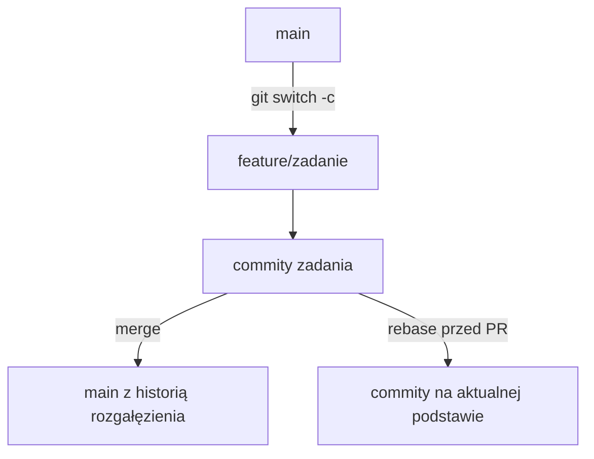

# 03. Gałęzie, merge, rebase i konflikty

## Cel laboratorium

Po wykonaniu tematu student potrafi pracować na osobnej gałęzi, zaktualizować ją względem
`main`, wyjaśnić intuicję merge i rebase oraz rozwiązać konflikt bez przypadkowego usuwania
cudzej zmiany.

## Po co są gałęzie?

Gałąź jest nazwanym wskaźnikiem na commit. Pozwala prowadzić pracę nad jednym zadaniem
niezależnie od stabilnej gałęzi `main`.

Typowa strategia dla małego projektu:

```text
main                         stabilna wersja
feature/nazwa-zadania        nowa funkcja
fix/nazwa-problemu            poprawka błędu
docs/nazwa-dokumentu          zmiana dokumentacji
```

Dobra gałąź:

- ma krótką nazwę opisującą cel,
- zaczyna się od aktualnego `main`,
- zawiera jedną logiczną pracę,
- jest usuwana po połączeniu, jeśli nie jest już potrzebna.

## Tworzenie i przełączanie gałęzi

```text
git switch main
git pull --rebase origin main
git switch -c feature/dodaj-instrukcje
# zmiany w plikach
git add README.md
git commit -m "Dodaj instrukcję uruchomienia"
git push -u origin feature/dodaj-instrukcje
git switch main
git branch --list
```

Starsza forma `git checkout -b` nadal działa, ale `git switch` wyraźniej komunikuje, że
operujemy gałęzią. `git branch -vv` pokazuje także śledzoną gałąź zdalną.



Źródło diagramu: [gałęzie i integracja](diagramy/galezie-i-integracja.mmd).

## Merge i rebase: intuicja

### Merge

Merge łączy dwie historie i może utworzyć osobny commit scalający. Nie zmienia istniejących
commitów. Jest dobrym wyborem, gdy historia gałęzi jest już współdzielona albo chcemy zachować
informację o rozgałęzieniu.

```text
git switch main
git merge feature/dodaj-instrukcje
```

### Rebase

Rebase przenosi commity gałęzi tak, jakby powstały na nowszym końcu `main`. Historia często
staje się liniowa, ale identyfikatory przenoszonych commitów się zmieniają. Nie przepisuj
rebase'em cudzej, wspólnej gałęzi bez uzgodnienia.

```text
git switch feature/dodaj-instrukcje
git fetch origin
git rebase origin/main
```

Reguła praktyczna: rebase własnej lokalnej gałęzi przed PR jest zwykle bezpieczny; rebase
publicznej gałęzi, na której pracują inni, wymaga szczególnej ostrożności.

## Lekcja kierowana: trzy problemy

### Problem 1: gałąź funkcji jest za `main`

**Sytuacja:** na `main` pojawił się commit, gdy pracowałeś na `feature/raport`.

**Wariant z merge:**

```text
git switch feature/raport
git fetch origin
git merge origin/main
# rozwiąż konflikt, jeśli wystąpi
git push
```

**Wariant z rebase:**

```text
git switch feature/raport
git fetch origin
git rebase origin/main
# rozwiąż konflikt, jeśli wystąpi
git push --force-with-lease
```

`--force-with-lease` stosuj tylko do własnej gałęzi i dopiero po sprawdzeniu, że nikt nie
wysłał na nią nowej pracy. Merge nie zmienia istniejących commitów; rebase zmienia ich podstawę.

### Problem 2: konflikt podczas rebase

**Sytuacja:** `README.md` zmieniono w `main` i na gałęzi funkcji w tej samej linii.

```text
git rebase origin/main
# CONFLICT (content): Merge conflict in README.md
git status
```

Kroki:

1. Otwórz `README.md`.
2. Znajdź znaczniki `<<<<<<<`, `=======`, `>>>>>>>`.
3. Wybierz poprawną treść albo połącz obie zmiany.
4. Usuń wszystkie znaczniki konfliktu.
5. Zapisz plik i sprawdź diff.
6. Wykonaj `git add README.md`.
7. Wykonaj `git rebase --continue`.
8. Po zakończeniu uruchom kontrolę i wypchnij własną gałąź.

Jeśli decyzja była błędna:

```text
git rebase --abort
```

### Problem 3: konflikt podczas merge

**Sytuacja:** chcesz połączyć `feature/raport` z `main`, ale obie gałęzie zmieniły ten sam
fragment.

```text
git switch main
git merge feature/raport
# CONFLICT (content): Merge conflict in README.md
git status
```

Kroki:

1. Otwórz plik wskazany przez `git status`.
2. Zostaw treść, która spełnia wymagania obu zmian, albo świadomie wybierz jedną wersję.
3. Usuń znaczniki konfliktu.
4. Wykonaj `git diff` i sprawdź rezultat w edytorze.
5. Wykonaj `git add README.md`.
6. Wykonaj `git commit`, jeśli Git nie utworzył commitu automatycznie.
7. Uruchom kontrolę i wykonaj `git push`.

Jeśli chcesz anulować merge przed zatwierdzeniem:

```text
git merge --abort
```

## Konflikty na prostych przykładach

### Przykład 1: ta sama linia

`main`:

```text
Status: wersja stabilna
```

`feature`:

```text
Status: wersja testowa
```

Git nie wie, która treść jest właściwa. Otwórz plik, wybierz decyzję zgodną z zadaniem i usuń
znaczniki konfliktu. Nie rozwiązuj konfliktu przez bezmyślne wybranie „ours” albo „theirs”.

### Przykład 2: dwie osoby dopisały różne linie

`main` dopisuje:

```text
- uruchom testy
```

`feature` dopisuje:

```text
- sprawdź README
```

Jeżeli linie są w różnych miejscach, Git może połączyć je automatycznie. Mimo to sprawdź
`git diff` i wynik pliku: brak konfliktu nie gwarantuje sensownej treści.

### Przykład 3: plik usunięty i zmieniony

`main` usuwa `notatki.txt`, a `feature` zmienia ten plik. Git poprosi o decyzję: zachować
zmiany, czy zaakceptować usunięcie. Sprawdź, czy plik nadal jest potrzebny według aktualnego
zadania, a potem wykonaj `git add -u` lub `git add notatki.txt` zgodnie z decyzją.

### Przykład 4: konflikt dodatni

Obie gałęzie tworzą plik `config.txt`, ale z inną zawartością. Nie kopiuj bezrefleksyjnie
konfiguracji, jeśli zawiera ścieżki lokalne lub sekrety. Utwórz bezpieczny wspólny wariant,
dodaj przykładowe wartości i opisz sekrety w `.gitignore`.

## Zadanie dla studenta: rozwiązanie konfliktu

1. Utwórz gałąź `feature/konflikt`.
2. W `konflikt.txt` zapisz `Wersja z gałęzi feature` i wykonaj commit.
3. Przełącz się na `main`, zmień tę samą linię na `Wersja z main` i wykonaj drugi commit.
4. Wróć na `feature/konflikt` i wykonaj `git merge main`.
5. Rozwiąż konflikt tak, aby plik zawierał:

```text
Wersja po uzgodnieniu zmian
Źródło: main i feature/konflikt
```

1. Sprawdź `git diff`, `git status` i historię `git log --graph --all`.
2. Zatwierdź rozwiązanie i usuń lokalną gałąź dopiero po sprawdzeniu wyniku.

### Rozwiązanie zadania

```text
git switch -c feature/konflikt
# utwórz konflikt.txt i wykonaj commit
git switch main
# zmień tę samą linię i wykonaj commit
git switch feature/konflikt
git merge main
# edytuj konflikt.txt według oczekiwanej treści
git add konflikt.txt
git commit -m "Rozwiąż konflikt w konflikcie"
git status
git log --oneline --graph --all
```

Poprawne rozwiązanie ma czysty `git status`, brak znaczników konfliktu i obie wymagane linie.
Jeżeli konflikt powstał w innym pliku niż oczekiwany, sprawdź `git status` zamiast zgadywać.

## Checklista

- [ ] Potrafię utworzyć i przełączyć gałąź.
- [ ] Wiem, kiedy merge zachowuje rozgałęzienie.
- [ ] Wiem, że rebase zmienia podstawę i identyfikatory commitów.
- [ ] Po rozwiązaniu konfliktu sprawdziłem znaczniki i diff.
- [ ] Znam `merge --abort` i `rebase --abort`.
- [ ] Nie używam `push --force` bez zrozumienia skutków.
