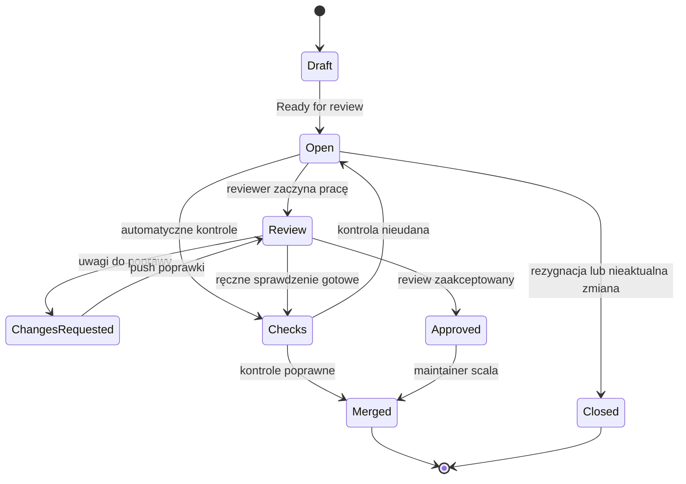

# 04. Pull Requesty, Issues i Projects

## Cel laboratorium

Po wykonaniu tematu student potrafi przygotować Pull Request na GitHubie, opisać zakres
zmiany, odpowiedzieć na komentarze review i zaktualizować swoją gałąź. Zna również
podstawowy odpowiednik Merge Request na GitLabie oraz potrafi użyć Issues i Projects do
planowania pracy.

## Pull Request: po co?

Pull Request (PR) to propozycja włączenia zmian z jednej gałęzi do drugiej. Najczęściej
źródłem jest `feature/nazwa`, a celem `main`. PR jest miejscem rozmowy, automatycznych kontroli
i decyzji o połączeniu kodu. Nie zastępuje commitu ani testów lokalnych.

Na GitLabie analogiczną funkcję pełni Merge Request (MR). Nazwy przycisków są inne, ale
idea jest taka sama: zmiana ma źródło, cel, opis, kontrolę i osoby przeglądające.

## Drzewo stanów PR



Źródło diagramu: [stany Pull Requestu](diagramy/stany-pull-requestu.mmd).

## Workflow PR krok po kroku

### Etap 1: przygotuj gałąź

```text
git switch main
git pull --rebase origin main
git switch -c feature/aktualizacja-readme
```

Wykonaj jedną logiczną zmianę, sprawdź ją lokalnie i zapisz:

```text
git status
git diff
git add README.md
git commit -m "Zaktualizuj instrukcję uruchomienia"
git push -u origin feature/aktualizacja-readme
```

### Etap 2: utwórz PR na GitHubie

1. Otwórz własne repozytorium na GitHubie.
2. Kliknij **Compare & pull request** albo **New pull request**.
3. Wybierz bazę `main` i compare branch `feature/aktualizacja-readme`.
4. Uzupełnij tytuł oraz opis według [szablonu PR](szablon-pull-request.md).
5. Dodaj reviewera, jeśli prowadzący lub zespół tego wymaga.
6. Zacznij jako **Draft**, jeśli praca nie jest gotowa do oceny.
7. Przed oznaczeniem jako gotowy sprawdź Files changed i zakładkę Checks.

### Etap 3: review i poprawki

Reviewer może:

- dodać komentarz do konkretnej linii,
- zadać pytanie,
- zaproponować poprawkę,
- zaakceptować PR,
- wybrać **Request changes**, jeśli problem trzeba naprawić przed scaleniem.

Autor odpowiada na komentarz przez zmianę w tej samej gałęzi:

```text
git switch feature/aktualizacja-readme
# popraw pliki
git diff
git add README.md
git commit -m "Uwzględnij uwagi z review"
git push
```

PR aktualizuje się automatycznie. Nie twórz nowego PR dla każdej poprawki do tego samego
zadania, chyba że zespół ustalił inaczej.

### Etap 4: zamknięcie

Po zaakceptowaniu i przejściu kontroli osoba uprawniona wybiera **Merge pull request**.
Po scaleniu sprawdź `main`, usuń niepotrzebną gałąź zdalną i zaktualizuj lokalny katalog:

```text
git switch main
git pull --rebase origin main
git branch -d feature/aktualizacja-readme
git push origin --delete feature/aktualizacja-readme
```

Usunięcie gałęzi nie usuwa commitów, które zostały scalone. Przed usunięciem sprawdź,
że PR rzeczywiście ma status **Merged**.

## Trzy przykłady krok po kroku

### Przykład 1: prosty PR dokumentacyjny

**Cel:** poprawić literówkę w README.

```text
git switch main
git pull --rebase origin main
git switch -c docs/popraw-literowke
# popraw README
git diff
git add README.md
git commit -m "Popraw literówkę w README"
git push -u origin docs/popraw-literowke
```

Na GitHubie ustaw bazę `main`, opisz zmianę i wskaż, że kontrolą było przeczytanie poprawionego
fragmentu. Reviewer sprawdza zakres diffu i może zaakceptować PR bez dodatkowej dyskusji.

### Przykład 2: review wymaga poprawki

**Sytuacja:** reviewer zauważa, że instrukcja nie opisuje przypadku pustych danych.

1. Reviewer komentuje konkretną linię: „Czy możemy dopisać oczekiwane zachowanie dla pustej listy?”.
2. Autor dopisuje przypadek w README.
3. Autor wykonuje `git diff`, commit i `git push`.
4. Reviewer sprawdza nowy commit i oznacza komentarz jako rozwiązany.
5. Autor nie usuwa komentarza ani nie zmienia historii tylko po to, aby ukryć rozmowę.

Przykładowy commit:

```text
git add README.md
git commit -m "Dodaj przypadek pustej listy"
git push
```

### Przykład 3: PR jest za `main`

**Sytuacja:** podczas review ktoś zmienił `main`, a GitHub pokazuje konflikt albo nieaktualną
gałąź.

```text
git switch feature/aktualizacja-readme
git fetch origin
git rebase origin/main
# rozwiąż konflikt, jeśli wystąpi
git push --force-with-lease
```

`push --force-with-lease` stosuj wyłącznie do własnej gałęzi PR i po sprawdzeniu, że nikt
inny nie wysłał na nią pracy. Alternatywnie zespół może wymagać merge `origin/main` do gałęzi.
Po aktualizacji poczekaj na ponowne przejście Checks.

## Szablon opisu PR

Pełny szablon znajduje się w pliku [szablon-pull-request.md](szablon-pull-request.md).
Minimalny opis powinien zawierać:

- cel zmiany,
- zakres plików,
- sposób sprawdzenia,
- wynik kontroli,
- informacje o ograniczeniach lub ryzyku,
- powiązane issue, np. `Closes #12`, jeśli repozytorium używa numerowanych Issues.

Tytuł `Dodaj walidację pustej listy` jest lepszy niż `Zmiany`, ponieważ po historii PR można
zrozumieć, czego dotyczyła praca.

## Kultura review

### Komentarz do kodu

```text
Problem: ta gałąź zwraca 0 także dla pustej listy.
Skutek: wynik wygląda jak poprawna średnia, choć dane wejściowe są niepoprawne.
Sugestia: dodaj walidację albo jawnie opisz, że lista nigdy nie jest pusta.
```

### Odpowiedź autora

```text
Dzięki, to rzeczywiście luka. Dodałem walidację pustej listy i test dla tego przypadku.
Commit: 8f2a1c4.
```

Unikaj komentarzy o osobie: „nie umiesz programować” nie pomaga. Mów o kodzie, wymaganiu,
ryzyku i możliwym rozwiązaniu. Autor może nie przyjąć sugestii, ale powinien wyjaśnić decyzję.

### Co reviewer sprawdza przed akceptacją

- Czy PR ma jeden cel?
- Czy diff nie zawiera plików lokalnych, sekretów ani niepotrzebnych zmian formatowania?
- Czy instrukcja uruchomienia nadal działa?
- Czy zmiana ma sprawdzenie lub test?
- Czy nazwy i komunikaty są zrozumiałe?
- Czy opis PR odpowiada faktycznemu diffowi?

## Issues

Issue opisuje zadanie, problem albo pomysł. Dobre issue jest małe i zamykalne.

### Przykładowe typy

- **Bug:** `Średnia zwraca 0 dla pustej listy`.
- **Task:** `Dodać instrukcję uruchomienia projektu`.
- **Improvement:** `Uzupełnić przykłady przypadków brzegowych`.

Na GitHubie wybierz **Issues -> New issue**. Na GitLabie odpowiednikiem jest **Plan -> Issues**.
Issue powinno zawierać opis, kryterium ukończenia i ewentualne zależności.

Przykład:

```markdown
## Cel
Dodać do README instrukcję dla osoby uruchamiającej projekt pierwszy raz.

## Kryteria akceptacji
- [ ] jest wymaganie dotyczące narzędzi,
- [ ] jest konkretne polecenie uruchomienia,
- [ ] jest oczekiwany wynik,
- [ ] jest opis jednego typowego problemu.
```

## Projects: tablica zadań

GitHub Projects pozwala pokazać pracę na tablicy. Minimalne kolumny:

```text
Backlog -> Ready -> In progress -> In review -> Done
```

Przykładowa praca:

1. Utwórz issue „Dodać checklistę PR”.
2. Dodaj je do projektu.
3. Umieść kartę w `Ready`.
4. Przenieś do `In progress`, gdy zaczniesz pracę.
5. Utwórz gałąź i PR powiązany z issue.
6. Po review przenieś kartę do `Done` i zamknij issue.

Na GitLabie podobną funkcję spełnia Issue Board. Nazwy kolumn mogą być inne, ale zasada
przepływu jest taka sama: karta opisuje pracę, a status pokazuje jej etap.

## Zadania do samodzielnego wykonania

### Zadanie 1: przygotuj PR

Utwórz gałąź `docs/pr-cwiczenie`, zmień jeden fragment README, wykonaj commit i utwórz
Draft PR. Uzupełnij szablon, dodaj informację o sprawdzeniu i wskaż pliki objęte zmianą.

#### Rozwiązanie zadania 1

PR powinien mieć:

- bazę `main`,
- źródło `docs/pr-cwiczenie`,
- opis celu i zakresu,
- jeden logiczny commit albo kilka logicznie powiązanych commitów,
- wynik `git diff` lub innej kontroli,
- status Draft, jeśli reviewer ma dopiero rozpocząć pracę.

Nie wklejaj całej historii terminala. W opisie zostaw informacje potrzebne reviewerowi.

### Zadanie 2: odpowiedz na review

Poproś osobę z pary o komentarz do konkretnej linii. Wprowadź poprawkę w tej samej gałęzi,
wykonaj nowy commit i odpowiedz w rozmowie PR, co zostało zmienione.

#### Rozwiązanie zadania 2

Poprawka powinna pojawić się w tym samym PR. Odpowiedź powinna wskazywać konkretny commit
lub fragment i informować, jak sprawdzono zmianę. Jeśli sugestia nie jest właściwa, opisz
powód techniczny zamiast ignorować komentarz.

### Zadanie 3: zaplanuj pracę przez Issue i Project

Utwórz issue dotyczące brakującej instrukcji, dodaj kryteria akceptacji i umieść je w tablicy.
Przenieś kartę przez co najmniej trzy statusy.

#### Rozwiązanie zadania 3

Przykładowy przepływ:

```text
Backlog: „Dodać instrukcję git fetch”
Ready: kryteria akceptacji są jasne
In progress: istnieje gałąź feature/docs-fetch
In review: istnieje PR powiązany z issue
Done: PR scalony, instrukcja sprawdzona
```

Status powinien opisywać rzeczywisty etap pracy, a nie być ustawiany dopiero na końcu.

### Zadanie 4: oceń PR

Wybierz dowolny mały PR ćwiczeniowy i odpowiedz:

1. Czy cel zmiany jest jasny?
2. Czy diff zawiera tylko zakres zadania?
3. Czy da się uruchomić lub sprawdzić zmianę według opisu?
4. Czy znalazłeś ryzyko albo brakujący przypadek?
5. Czy możesz zaakceptować PR, czy potrzebne są poprawki?

#### Rozwiązanie zadania 4

Przykładowa odpowiedź:

```text
Cel jest jasny, a diff dotyczy tylko README. Instrukcja uruchomienia działa.
Brakuje opisu zachowania dla pustej wartości, więc proszę o dopisanie przypadku brzegowego.
Po tej poprawce mogę zaakceptować PR.
```

Review jest użyteczne wtedy, gdy prowadzi do decyzji lub konkretnej poprawki.

## Checklista końcowa

- [ ] Potrafię utworzyć PR z własnej gałęzi do `main`.
- [ ] Wiem, gdzie znaleźć diff i Checks.
- [ ] Umiem odpowiedzieć na komentarz przez nowy commit.
- [ ] Znam różnicę między PR GitHub a MR GitLab.
- [ ] Potrafię utworzyć issue z kryteriami akceptacji.
- [ ] Potrafię przenieść zadanie przez tablicę Projects.
