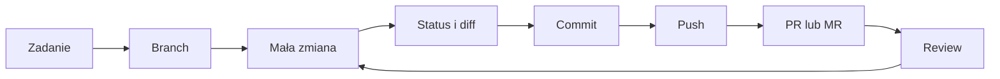

# 03. Git: repozytoria, gałęzie i Pull Requesty

## Cel działu

Celem laboratoriów jest nauczenie się pracy z historią zmian i współpracy nad kodem bez
przesyłania plików jako załączników. Student wykonuje polecenia na małym repozytorium,
a następnie stosuje ten sam model w swoim projekcie.

Po wykonaniu działu student potrafi:

- utworzyć repozytorium i zapisać zmianę w historii,
- odczytać stan plików za pomocą `status`, `log` i `diff`,
- korzystać z `.gitignore` i pisać zrozumiałe komunikaty commitów,
- synchronizować własne repozytorium z GitHubem lub GitLabem,
- pracować na gałęziach i wybrać merge albo rebase,
- rozwiązać konflikt i sprawdzić rezultat po jego rozwiązaniu,
- przygotować Pull Request na GitHubie lub Merge Request na GitLabie,
- wykonać podstawowy code review i zarządzać zadaniami przez Issues i Projects.

## Wymagania

- zainstalowany Git,
- konto GitHub lub GitLab,
- terminal i edytor tekstu albo IDE,
- własne repozytorium studenta, zgodnie z zasadami opisanymi w
  [materiale o oddawaniu prac](../01-organizacja/02-struktura-materialow-i-oddawanie/README.md).

Przykłady używają zwykłych plików tekstowych. Nie trzeba znać konkretnego języka
programowania. Git śledzi zmiany w plikach, a nie znaczenie kodu.

## Mapa działu

| Temat | Najważniejsza praktyka | Materiał |
| --- | --- | --- |
| 1. Podstawy Gita | lokalna historia, `.gitignore`, dobre commity | [README tematu](01-podstawy-gita/README.md) |
| 2. Repozytorium zdalne | remote, fetch, pull, push, praca w parach | [README tematu](02-repozytorium-zdalne-i-review/README.md) |
| 3. Gałęzie i konflikty | branch, merge, rebase, rozwiązywanie konfliktów | [README tematu](03-galezie-merge-rebase/README.md) |
| 4. Pull Requesty | workflow PR, review, Issues i Projects | [README tematu](04-pull-requesty-issues-projects/README.md) |

## Zalecany model pracy

Źródło diagramu: [model pracy z Gitem](diagramy/model-pracy-z-gitem.mmd).

## Wspólna checklista

- [ ] Wiem, w którym repozytorium i na której gałęzi pracuję.
- [ ] Przed zmianą sprawdziłem `git status`.
- [ ] Przed commitem przeczytałem `git diff`.
- [ ] Commit opisuje jedną logiczną zmianę.
- [ ] Nie dodałem sekretów, plików IDE ani artefaktów budowania.
- [ ] Przed `push` pobrałem potrzebne zmiany z remote.
- [ ] PR/MR ma opis, zakres i informację o sprawdzeniu.
- [ ] Po konflikcie sprawdziłem zarówno kod, jak i status repozytorium.
